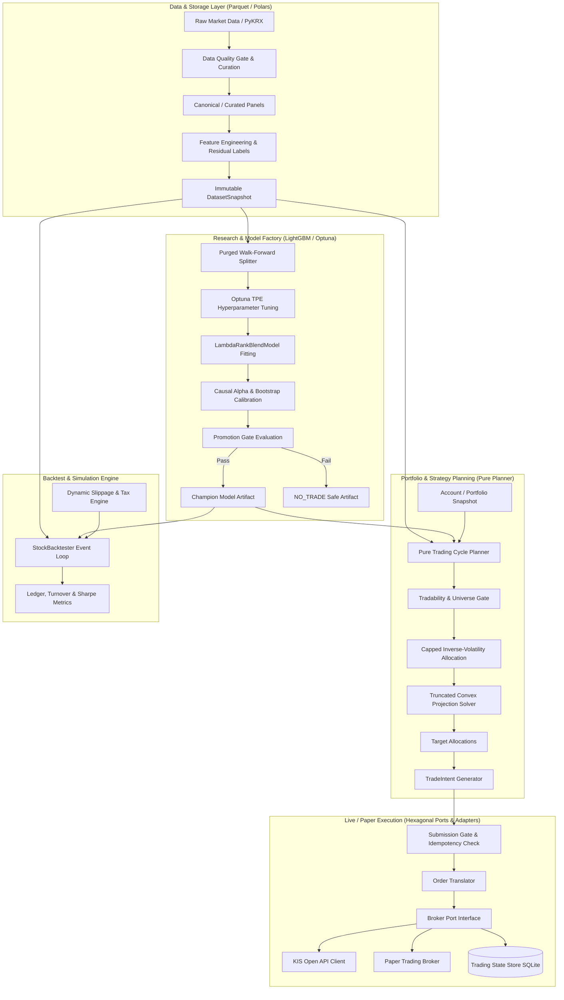
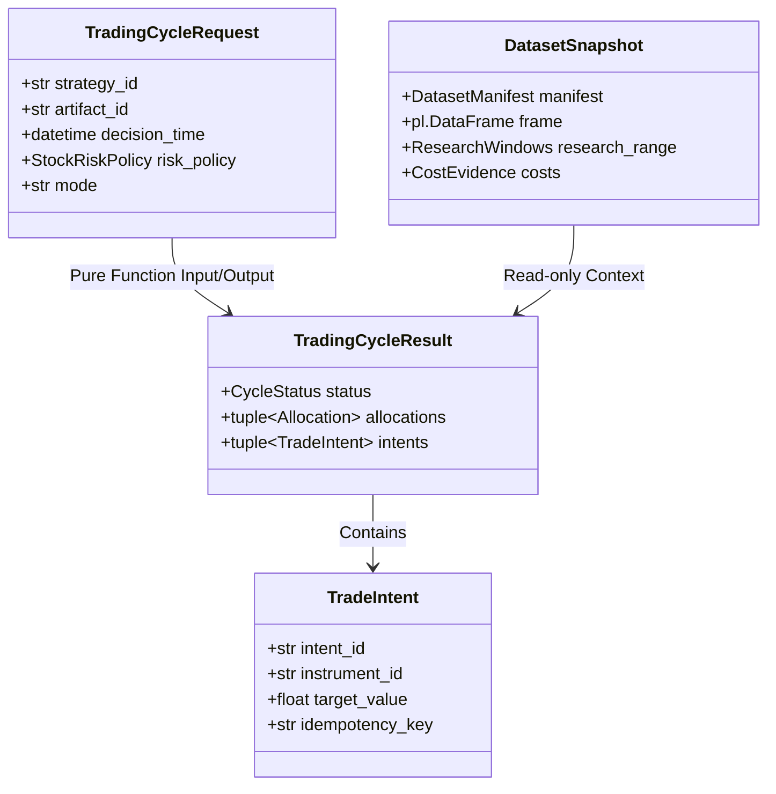

# 🚀 K-Stock Engine

[](https://www.python.org/)
[](#-시스템-아키텍처-system-architecture)
[](#-핵심-알고리즘-및-금융공학-로직)
[](#-데이터-파이프라인-및-불변-계약)
[](#-개발-및-품질-검증)

**K-Stock Engine**은 한국 주식 시장(KOSPI / KOSDAQ) 및 ETF를 대상으로 머신러닝 기반 퀀트 알파 발굴, 포트폴리오 리스크 최적화, 정밀 백테스트 시뮬레이션, 그리고 한국투자증권(KIS) API 실전 주문 체결까지 전 과정을 엔드투엔드로 지원하는 **프로덕션급 퀀트 트레이딩 엔진**입니다.

---

## 📌 목차 (Table of Contents)

1. [핵심 설계 철학](#-핵심-설계-철학-core-design-principles)
2. [시스템 아키텍처 (System Architecture)](#-시스템-아키텍처-system-architecture)
3. [엔드-투-엔드 데이터 및 트레이딩 파이프라인](#-엔드-투-엔드-파이프라인-end-to-end-pipeline)
4. [디렉토리 구조 (Directory Structure)](#-디렉토리-구조-directory-structure)
5. [핵심 알고리즘 및 금융공학 로직](#-핵심-알고리즘-및-금융공학-로직)
6. [데이터 파이프라인 및 불변 계약 (Data Contracts)](#-데이터-파이프라인-및-불변-계약)
7. [리스크 관리 및 포트폴리오 가드레일](#-리스크-관리-및-포트폴리오-가드레일)
8. [시작하기 및 CLI 실행 가이드](#-시작하기-및-cli-실행-가이드)
9. [개발 및 품질 검증](#-개발-및-품질-검증)

---

## 💡 핵심 설계 철학 (Core Design Principles)

1. **결정론적 Pure Planner (Side-Effect Free)**
   - 트레이딩 사이클 플래너([`run_trading_cycle`](src/stocks/workflows/trading_cycle.py))는 I/O, 네트워크, 외부 상태 변경이 전혀 없는 **순수 함수(Pure Function)**로 동작합니다.
   - 통제된 시점 데이터 스냅샷과 계좌 상태를 입력받아 언제 어디서 실행하든 100% 동일한 불변 결과([`TradingCycleResult`](src/stocks/workflows/trading_cycle.py))를 반환합니다.

2. **철저한 시점 무결성 (Point-in-Time Integrity)**
   - 미래 데이터 참조(Look-ahead bias)를 구조적으로 차단하기 위해 `available_time <= decision_time` 필터링을 강제하며, 플래너 입력 시 레이블 컬럼(`target_*`, `label_*`)을 자동 제거합니다.

3. **시뮬레이션과 실전의 완전 대칭성 (Replay & Live Symmetry)**
   - 백테스트 시뮬레이터([`StockBacktester`](src/stocks/backtesting/engine.py))와 실전 매매 플래너가 정확히 동일한 포트폴리오 생성기([`portfolio_constructor.py`](src/stocks/trading/portfolio_constructor.py)) 및 비중 계산 로직을 공유합니다.

4. **Purged & Embargoed Walk-Forward 검증**
   - 금융 시계열의 자기상관성(Autocorrelation)으로 인한 과적합(Overfitting)을 방지하기 위해 훈련-검증 구간 사이에 Purge(레이블 중첩 제거) 및 Embargo(시계열 연관성 차단)를 적용한 분기별 확장 롤링 검증을 거칩니다.

5. **헥사고날 아키텍처 기반의 안전한 주문 실행 (Execution Engine)**
   - 도메인 로직과 브로커(KIS API, Paper Broker), 데이터베이스(SQLite, In-Memory)가 포트-어댑터 구조로 분리되어 테스트 용이성과 멱등성(Idempotency)을 보장합니다.

---

## 🏛 시스템 아키텍처 (System Architecture)



---

## 🔄 엔드-투-엔드 파이프라인 (End-to-End Pipeline)

K-Stock Engine 주식 알파 시스템(`src/stocks`)은 4단계 파이프라인으로 유기적으로 구동됩니다.

| 단계 | 주요 모듈 및 스크립트 | 설명 및 역할 |
| :--- | :--- | :--- |
| **Phase 1. Data Curation** | [`curation.py`](src/stocks/data/curation.py)<br>[`research_v2.py`](src/stocks/data/research_v2.py) | • 결측치, 이상치, 거래정지 여부 검증<br>• 기술적/팩터 피처 및 OLS 잔차 레이블 생성<br>• 불변 `DatasetSnapshot` 매니페스트 발급 |
| **Phase 2. Model Research** | [`lambdarank.py`](src/stocks/research/lambdarank.py)<br>[`train_model.py`](src/stocks/workflows/train_model.py) | • Purged & Embargoed Walk-Forward CV<br>• LightGBM LambdaRank 앙상블 블렌딩 및 Optuna TPE 튜닝<br>• Causal Alpha 캘리브레이션 및 승진 게이트 심사 |
| **Phase 3. Trading Planning** | [`trading_cycle.py`](src/stocks/workflows/trading_cycle.py)<br>[`portfolio_constructor.py`](src/stocks/trading/portfolio_constructor.py) | • 시점(`Point-in-Time`) 가용 데이터 스냅샷 필터링<br>• Top-K 역변동성 가중 및 4대 볼록 제약조건 최적화<br>• 멱등성 키가 부여된 `TradeIntent` 발급 |
| **Phase 4. Simulation & Live** | [`engine.py`](src/stocks/backtesting/engine.py)<br>[`submit_intents.py`](src/execution/application/submit_intents.py) | • 동적 시장 충격(Square-Root Slippage) 기반 백테스트<br>• KIS OpenAPI / Paper Broker 주문 실행 및 상태 추적 |

---

## 📂 디렉토리 구조 (Directory Structure)

```
k-stock-engine/
├── config/                     # 전역 환경설정 및 기본 인프라 설정
│   └── base.py
├── data/                       # 파티셔닝된 Parquet 데이터 저장소 (Git 제외)
│   ├── canonical/              # 정제된 기준 주가/재무/지수 데이터
│   ├── curated/                # 품질 검증 완료된 주식 패널
│   ├── derived/                # 피처 및 레이블이 포함된 리서치 데이터
│   ├── evidence/               # 거래대금, 수수료, 가용시간 증거
│   └── market_index/           # KOSPI/KOSDAQ 및 VIX 일별 데이터
├── docs/                       # 아키텍처 명세서, ADR, 백테스트 결과 리포트
│   ├── architecture/           # 시스템 아키텍처 상세 문서 (stock-explain.md 등)
│   └── results/                # Walk-Forward 백테스트 및 ML 실험 결과
├── src/                        # 핵심 소스코드 루트
│   ├── core/                   # 전역 공통 도메인/데이터 계약 (포트폴리오, 시간, 데이터셋)
│   │   ├── costs.py            # 거래비용 모델 인터페이스
│   │   ├── datasets.py         # 데이터셋 매니페스트 및 스냅샷 기본 정의
│   │   ├── instruments.py      # 종목 식별자 및 메타데이터 정의
│   │   └── portfolio.py        # 포트폴리오 스냅샷 및 포지션 엔티티
│   ├── stocks/                 # 주식(Stock) 알파 리서치 및 트레이딩 파이프라인
│   │   ├── backtesting/        # 고속 시뮬레이션 및 백테스터 이벤트 루프
│   │   ├── cli/                # 파이프라인 CLI 진입점 (curate, train, simulate, intents 등)
│   │   ├── data/               # 데이터 큐레이션, 증거 수집, 잔차 레이블링, 동적 비용 모델
│   │   ├── domain/             # 주식 유니버스 및 필터 정책 정의
│   │   ├── research/           # LambdaRank, Optuna, Walk-Forward Folds, 캘리브레이션
│   │   ├── trading/            # 포트폴리오 최적화기 (Capped Inverse-Vol, 제약조건 해결기)
│   │   └── workflows/          # Pure Planner, 모델 학습/추론, Intent 생성 워크플로우
│   ├── etfs/                   # ETF 자산배분 및 인덱스 스위칭 파이프라인
│   │   ├── backtesting/        # ETF 백테스팅 엔진
│   │   ├── cli/                # ETF 백테스트/최적화 CLI
│   │   ├── research/           # Walk-Forward 파라미터 최적화
│   │   └── strategies/         # 인덱스 스위칭 전략 구현체
│   ├── execution/              # 헥사고날 아키텍처 기반 실전/모의 주문 실행 시스템
│   │   ├── adapters/           # KIS API 클라이언트, Paper Broker, SQLite 상태 저장소
│   │   ├── application/        # 의도 검증(Validation), 제출 게이트(Submission Gate)
│   │   ├── domain/             # TradeIntent, Order, Fill 도메인 엔티티
│   │   └── ports/              # BrokerPort, StateStorePort 인터페이스
│   └── storage/                # Parquet / Arrow I/O 데이터셋 저장소 레이어
├── tests/                      # Pytest 유닛/통합/회귀 테스트 스위트
└── pyproject.toml              # 프로젝트 종속성 및 린터/타입체커(Ruff, Mypy) 설정
```

---

## 🧮 핵심 알고리즘 및 금융공학 로직

### 1. LightGBM LambdaRank & Blend Ensemble ([`lambdarank.py`](src/stocks/research/lambdarank.py))
- **Learning-to-Rank (LTR)**: 단순히 종목의 절대 수익률을 회귀(Regression) 예측하는 대신, 동일 거래 세션(`session`) 내 종목들 간의 상대적 우위 순위를 NDCG(Normalized Discounted Cumulative Gain) 목적 함수로 직접 최적화합니다.
- **다중 시드 블렌딩 (`LambdaRankBlendModel`)**: 서로 다른 트리 깊이, 피처 샘플링 비율, 학습률을 조합한 복수 랭킹 모델을 앙상블 결합하여 과적합을 방지하고 일반화 성능을 극대화합니다.

### 2. OLS 잔차 수익률 레이블링 (Residual Return Labeling) ([`labels.py`](src/stocks/research/labels.py))
- 시장 전체의 상승/하락($M_t$) 및 섹터 효과($S_{k,t}$)를 OLS 회귀로 제거하여, 오직 개별 종목 고유의 순수 초과 알파($\epsilon_{i,t}$)만을 레이블 타겟으로 추출합니다:
  $$R_{i,t} = \alpha_i + \beta_i M_t + \gamma_i S_{k,t} + \epsilon_{i,t}$$

### 3. 인과적 알파 캘리브레이션 (Causal Alpha Calibration) ([`economic_alpha.py`](src/stocks/research/economic_alpha.py))
- 머신러닝 모델의 상대 점수(Rank Score)를 실제 기대 초과 수익률 및 순수익률(Net Alpha)로 변환합니다.
- **Moving-Block Bootstrap & Shrinkage**: 역사적 표본 평균으로의 수축(Shrinkage) 기법과 블록 부트스트랩을 적용하여 $95\%$ 신뢰구간 하한($\text{Alpha Lower Bound}$)을 산출하며, 하한이 $0$ 이하인 경우 매수를 차단합니다.

### 4. 제약조건 절단 볼록 투영 최적화 (Truncated Convex Constraint Projection) ([`portfolio_constructor.py`](src/stocks/trading/portfolio_constructor.py))
- Top-K 종목의 변동성 역수($1/\sigma_i$)를 초기 비중으로 산정한 뒤, 다음 4가지 포트폴리오 가드레일을 동시에 만족할 때까지 반복 수렴 절단 알고리즘을 수행합니다:
  1. **Single-Name Cap**: $w_i \le \text{single\_name\_cap}$ (단일 종목 최대 한도, 예: 10%)
  2. **Gross Exposure Cap**: $\sum w_i \le \text{gross\_cap}$ (총 익스포저 한도, 예: 100%)
  3. **Sector Exposure Cap**: $\sum_{i \in \text{Sector}_k} w_i \le \text{sector\_cap}$ (특정 섹터 쏠림 방지)
  4. **Liquidity Cap**: $\text{Notional}_i \le \text{participation\_limit} \times \text{ADTV}_i$ (일평균 거래대금 대비 참여율 한도)

### 5. 제곱근 시장 충격 슬리피지 모델 (Square-Root Slippage) ([`costs.py`](src/stocks/data/costs.py))
- 현실적인 체결 비용을 시뮬레이션하기 위해 거래대금 대비 주문 비중과 변동성을 반영한 Almgren-Chriss 기반 제곱근 충격 모델을 적용합니다:
  $$\text{Slippage}_i = c_0 + c_1 \cdot \left( \frac{\text{Order Notional}_i}{\text{ADTV}_i} \right)^{0.5} \cdot \sigma_i$$

---

## 🔒 데이터 파이프라인 및 불변 계약

- **`DatasetSnapshot`**: 불변 데이터셋 프레임과 매니페스트, 수집 메타데이터를 묶어 관리.
- **`TradingCycleRequest` / `TradingCycleResult`**: 플래너의 입력과 출력을 엄격한 타입으로 검증.
- **`TradeIntent`**: 모든 매매 의도는 `strategy_id:instrument_id:date` 기반의 고유한 **멱등성 키(`idempotency_key`)**를 부여받아 중복 주문을 원천 차단.



---

## 🛡 리스크 관리 및 포트폴리오 가드레일

K-Stock Engine은 이상 시장 상황에서도 자산을 안전하게 보호하기 위해 다중 방어 메커니즘을 내장하고 있습니다:

- **Promotion Gate (승진 게이트)**: Out-of-Sample 구간의 Sharpe Ratio, MDD, 회전율, 거래비용 스트레스 테스트를 통과한 모델만 실전(`promoted = True`)에 투입.
- **NO_TRADE 안전 장치**: 승진 요건 미달 시 `NO_TRADE` 아티팩트가 생성되어 신규 매수를 전면 중단하고 현금 보유.
- **DE_RISK 비상 매도 모드**: 시장 충격이나 포트폴리오 제약 이탈 시, 신규 진입을 전면 차단하고 보유 비중 축소 및 청산 매도만 허용하는 안전 알고리즘 작동.

---

## ⚡ 시작하기 및 CLI 실행 가이드

### 1. 환경 설정

본 프로젝트는 초고속 패키지 매니저인 [`uv`](https://github.com/astral-sh/uv)를 표준 도구로 사용합니다.

```bash
# 저장소 클론 및 가상환경 동기화
git clone https://github.com/KTHYEONG/k-stock-engine.git
cd k-stock-engine
uv sync
```

### 2. 주식 알파 파이프라인 CLI 단계별 실행

#### Step 1: 데이터 큐레이션 및 품질 검증
```bash
uv run python -m src.stocks.cli.curate
```

#### Step 2: 시장 증거(ADTV, 거래비용, 가용시점) 수집
```bash
uv run python -m src.stocks.cli.collect_evidence
```

#### Step 3: 리서치 피처 및 잔차 레이블 스냅샷 구축
```bash
uv run python -m src.stocks.cli.build_research_v2
```

#### Step 4: Purged Walk-Forward 모델 학습 및 승진 평가
```bash
uv run python -m src.stocks.cli.train --trials 50
```

#### Step 5: 역사적 데이터 기반 포트폴리오 백테스트 시뮬레이션
```bash
uv run python -m src.stocks.cli.simulate
```

#### Step 6: 실전 트레이딩 사이클 플래닝 및 TradeIntent 생성
```bash
uv run python -m src.stocks.cli.intents --decision-date 2026-08-20
```

---

## 🧪 개발 및 품질 검증

본 저장소는 철저한 타입 안전성(Type Safety)과 코드 품질을 유지합니다. 모든 검증 및 테스트는 `uv run` 접두사를 사용합니다.

```bash
# 1. 정적 코드 분석 및 린트 검사 (Ruff)
uv run ruff check .

# 2. 엄격한 정적 타입 검사 (Mypy Strict Mode)
uv run mypy src

# 3. 전체 유닛 및 통합 테스트 실행 (Pytest)
uv run pytest

# 4. 고속 단위 테스트만 실행 (Slow 제외)
uv run pytest -m "not slow"
```

---

## 📄 라이선스 (License)

본 프로젝트는 내부 연구 및 트레이딩 목적으로 구축된 독점 엔진입니다. 상세 라이선스 규정은 저장소 정책을 참조하세요.
