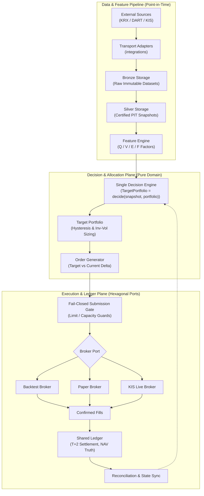
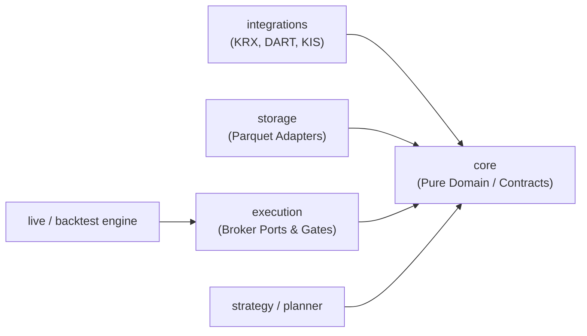

# 🚀 K-Stock Engine

[](https://www.python.org/)
[](#-시스템-아키텍처-system-architecture)
[](#-품질-검증-및-테스트)
[](#-실전-안전-제약-및-프로모션-게이트)

K-Stock Engine은 한국 주식 시장(KOSPI / KOSDAQ) 대상의 **기하 복리 성장(Geometric Compounding Growth) 극대화**와 **무결점 실전 집행(Deterministic Execution)**을 보장하는 헥사고날 아키텍처 기반 퀀트 트레이딩 엔진입니다.

---

## 📌 Executive Summary

기존 퀀트 시스템의 고질적 결함인 **미래 참조 편향(Look-ahead Bias), 비현실적 무마찰 체결(Zero-Friction Illusion), 백테스트-실거래 로직 분리(Divergence)**를 엔지니어링 단계에서 원천 차단합니다.

$$
g = \frac{252}{N}\sum_{t=1}^{N}\log(1+r_t^{net}), \quad r_t^{net}=r_t^{gross}-commission_t-tax_t-spread_t-slippage_t-impact_t
$$

- **순수 헥사고날 분리**: 도메인 불변식(`core`)과 브로커 어댑터(`execution`), 외부 통신(`integrations`)을 완전 격리하여 환경 독립적 실행 보장.
- **단일 의사결정 계약(Single Decision Contract)**: 동일한 전략 플래너(`TargetPortfolio = strategy.decide(snapshot, portfolio)`)가 백테스트, 페이퍼, 실거래를 100% 동일하게 구동.
- **T+1 / T+2 단일 원장(Shared Ledger)**: T일 종가 신호 동결 후 T+1 체결 원칙, 거래소 결제 주기(T+2) 미결제 예수금 추적을 통해 마이너스 예수금 및 체결 왜곡 원천 제거.
- **Fail-Closed 방어 메커니즘**: 데이터 정합성 결여, 공시 시점 불일치, 원장 불일치 발생 시 포지션을 확대하지 않고 즉시 주문 중단(`NO_TRADE`).

---

## 🎯 문제 정의 및 엔지니어링 솔루션

| 도메인 취약점 | 전형적인 퀀트 시스템의 실패 | K-Stock Engine 엔지니어링 솔루션 |
| :--- | :--- | :--- |
| **미래 참조 편향<br>(Look-ahead Bias)** | 분기 실적 보고서 공시일을 재무제표 기준일(분기말)로 역산 처리하여 백테스트 과대평가 | **DART 접수 시각 기반 PIT(Point-in-Time) Silver 레이어** 구축으로 공시 유효 시각 이후만 반영 |
| **종가 매매 왜곡<br>(Close-to-Close Bug)** | T일 종가로 생성한 리밸런싱 주문을 T일 종가에 즉시 체결하는 비현실적 가정 | **T-Close 신호 동결 $\rightarrow$ T+1 장중 체결 원칙** 및 신호 확정-주문 집행 라이프사이클 분리 |
| **예수금 왜곡<br>(Settlement Bug)** | 매도 즉시 현금이 입금된 것으로 가정하여 T+1일에 초과 매수 주문 발송 (미수금 발생) | **T+2 결제 주기 엄격 반영 단일 원장(Shared Ledger)**: 미결제 예수금(Unsettled Cash) 상태 모델링 |
| **실전 로직 괴리<br>(Env Divergence)** | 연구용 백테스터와 실전 트레이딩 봇의 코드베이스가 분리되어 실거래 시 시그널 누락 | **Single Decision Engine Contract**: 단일 플래너 인터페이스를 Backtest/Paper/KIS Broker가 공유 |
| **과적합 & P-hacking** | 특정 백테스트 기간의 CAGR을 최대화하기 위해 수십 개의 팩터 파라미터 튜닝 | **Minimal Degrees of Freedom & 7대 프로모션 게이트**: 사전 고정된 팩터 및 OOS 워크포워드 평가 |
| **비용 착시<br>(Friction Neglect)** | 고정 슬리피지만 반영하여 중소형주 대량 주문 시 슬리피지 폭증으로 실전 손실 | **비선형 시장 충격 모델($\sigma_i\sqrt{Participation}$)** 및 Ideal/Base/Stress 3단계 비용 검증 |

---

## 🏛 시스템 아키텍처 (System Architecture)

K-Stock Engine은 외부 데이터 공급원 및 브로커 API와 순수 트레이딩 전략 로직을 헥사고날 포트/어댑터 패턴으로 엄격하게 격리합니다.



### 아키텍처 의존성 역전 원칙

- `core`는 어떤 외부 라이브러리(네트워크, 브로커 SDK, DB)에도 의존하지 않는 순수 도메인 및 시간 계약만 유지합니다.
- 모든 어댑터는 포트에 의존하며, 포트는 어댑터의 세부 구현을 알지 못합니다.

---

## 🛡 7대 글로벌 불변식 (Global Invariants)

엔진 전반에서 어떤 예외 상황에서도 침해될 수 없는 절대 원칙입니다.

1. **Point-in-Time (PIT)**: 시스템이 소비하는 모든 데이터 행은 관측 당시 실제 유효했던 실세계 가용 시각(Availability Boundary)을 명시해야 함.
2. **Single Decision Engine**: 백테스트, 모의투자(Paper), 실전(Live) 환경은 100% 동일한 의사결정 계약 코드(`strategy.decide`)를 실행함.
3. **Net PnL First**: 오직 거래 비용과 세금이 실차감된 단일 원장(Shared Ledger)의 NAV만이 성과의 유일한 진실(Single Source of Truth)임.
4. **Minimal Degrees of Freedom**: 챔피언 전략의 모든 파라미터는 OOS(Out-of-Sample) 평가 이전에 영구 동결되며 임의 튜닝을 금지함.
5. **Fail Closed**: 데이터 출처 누락, 정산 불일치, 호가 공백, 계좌 동기화 오류 발생 시 즉시 거래 중단(`NO_TRADE`) 또는 승격 실패 처리.
6. **Long Only**: v1 코어에서는 신용 매도(Short) 및 레버리지 차입을 일절 배제하여 무한대 청산 위험 제거.
7. **Execution Separation**: 리서치는 알파 존재를 검증하고, 전략은 목표 포트폴리오를 정의하며, 실행 계층은 실제 체결 결과만을 보고함.

---

## 🔄 엔드투엔드 파이프라인 & 경계 계약

| 서브시스템 | 입력 (Input) | 출력 (Output) | 보장 불변식 (Invariant) | 금지 행위 (Must Not Own) |
| :--- | :--- | :--- | :--- | :--- |
| **Integrations** | 외부 API 요청 | 원시 응답 + 검색 메타데이터 | 네트워크 실패 시 안전 재시도 및 오류 격리 | 도메인 정책, 팩터 계산, 주문 상태 관리 |
| **Storage** | 원시 관측치 & Manifest | Parquet 스토리지 파일 | 스키마 검증 및 데이터 불변성(Immutable) | 종목 선정, 매매 신호 생성 |
| **PIT Data** | Bronze Parquet | PIT 보증 Silver 스냅샷 | 공시 시각 기준 미래 참조 완전 차단 | 알파 가중치 계산, 브로커 상태 참조 |
| **Features** | PIT Silver 스냅샷 | 표준화된 팩터 행 (Q/V/E/F) | 결측치 대체 규칙 및 순위화 결정론 | 포트폴리오 비중 최적화 |
| **Strategy** | 시장 스냅샷 + 포트폴리오 상태 | TargetPortfolio | 동일 입력에 대한 동일 출력 (순수 함수형) | 브로커 전송, 체결 수량 임의 수정 |
| **Execution** | 목표 포트폴리오 + 계좌 상태 | 주문 의도 (Order Intents) | 매도 우선 실행 및 호가 단위(Tick) 준수 | 팩터 재계산, 과거 데이터 조회 |
| **Shared Ledger** | 체결 내역 (Fills), 배당, 권리 | 현금, 보유잔고, 실현비용, NAV | T+2 정산 추적, 마이너스 현금 불가 | 미래 기대수익률 추정, 주문 생성 |
| **Validation** | OOS 원장 & 실험 아티팩트 | PASS / FAIL 승격 판정 | 7대 승격 게이트 엄격 검증 | 전략 파라미터 사후 보정 |

---

## 🚦 실전 안전 제약 및 프로모션 게이트

연구 단계의 알파가 실전에 투입되기 위해 통과해야 하는 **7대 프로모션 게이트(Promotion Gates)**입니다.

| 게이트 | 검증 기준 (PASS Condition) | 방어 결함 |
| :--- | :--- | :--- |
| **Data Integrity** | 미래 참조, 중복 체결, 권리락 왜곡, 원장 불일치 0건 | 데이터 무결성 훼손 및 가짜 백테스트 |
| **OOS Performance** | 벤치마크 대비 순수 초과 CAGR +3%p 이상, Sharpe $\ge 0.8$, MDD $\le 25\%$ | 시장 단순 추종 및 과도한 하방 리스크 |
| **Year Stability** | 연도별 절대 플러스 수익 비율 $\ge 70\%$, 벤치마크 아웃퍼폼 비율 $\ge 60\%$ | 특정 장세 편향 및 일시적 운에 의한 수익 |
| **Concentration Guard** | 단일 연도가 누적 복리 알파의 $50\%$ 이상을 점유하지 않음 | 단일 테마/종목 급등에 의존한 성과 왜곡 |
| **Cost Stress** | 2배 마켓 임팩트/슬리피지 스트레스 환경에서도 순수 Net CAGR 플러스 유지 | 거래 비용 폭증에 따른 실전 계좌 잠식 |
| **Parameter Stability** | 유니버스 크기($N$) 및 리밸런싱 주기 변경 시 성과의 $70\%$ 이상 유지 | 과최적화 절벽(Overfitting Cliff) 방지 |
| **Factor Ablation** | Quality, Value, Earnings, Foreign 각 팩터 제거 시 민감도 검증 | 숨겨진 단일 팩터 종속성 배제 |

---

## ⚖️ 핵심 엔지니어링 의사결정 (ADR Matrix)

| 결정 영역 | 채택한 아키텍처 (Selected) | 기각된 대안 (Rejected) | 엔지니어링 트레이드오프 & 채택 근거 |
| :--- | :--- | :--- | :--- |
| **코어 아키텍처** | **순수 헥사고날 포트 & 어댑터** | 올인원 모놀리식 프레임워크 | 브로커 API 변경이나 테스트 가상화 시 코어 전략 코드 수정을 0으로 유지. 의존성 역전을 통해 단위 테스트 속도와 결정론 확보. |
| **체결 라이프사이클** | **T+1 장중 체결 + T+2 정산 원장** | T일 종가 즉시 체결 (Close-to-Close) | T일 종가 신호 동결 후 T+1 체결로 실행 가능성 확보. 거래소 2영업일 결제 주기를 원장에 모델링하여 미수금 리스크 제거. |
| **알파 모델링** | **사전 고정 챔피언 팩터 (Q/V/E/F)** | 딥러닝/강화학습 복합 모델 | 자유도(Degrees of Freedom)를 극도로 제한하여 샘플 외(OOS) 일반화 능력 극대화. 설명 가능성과 팩터 애블레이션 투명성 보장. |
| **데이터 파이프라인** | **DART 접수시각 기반 PIT Silver** | 공시 기준일(분기말) 역산 파이프라인 | 45일 공시 유예 기간 동안의 정보 누수를 원천 차단하여 실전과 동일한 정보 접근 시점을 보장. |
| **코드베이스 관리** | **Hard-cut 활성/보관 경계 분리** | 레거시 호환 레이어(Shims) 유지 | 과거 실험 코드와 신규 프로덕션 엔진의 혼선을 방지. `legacy/`를 분리 격리하여 프로덕션 의존성 청결성 유지. |

---

## 📂 디렉토리 구조 및 활성/보관 경계

```
k-stock-engine/
├── data/                       # Parquet 데이터 저장소 (Git 제외)
├── docs/
│   ├── architecture/           # 핵심 아키텍처 및 도메인 제약 문서 (00~08)
│   └── specs/                  # 스킬 워크플로우 명세 및 계약
├── src/                        # [ACTIVE] 프로덕션 코어 엔진
│   ├── core/                   # 순수 도메인 모델, 시간 계약, 프로젝트 경로
│   ├── storage/                # Manifest 기반 Parquet I/O 어댑터
│   ├── execution/              # 브로커 포트, 페이퍼 브로커, 주문 게이트
│   └── integrations/           # 전송 전용 어댑터 (kis, krx, dart)
├── tests/                      # [ACTIVE] 활성 테스트 스위트
│   ├── unit/                   # core, storage, execution, integrations 단위 테스트
│   └── integration/            # execution 브로커 통합 테스트
├── legacy/                     # [ARCHIVED] 과거 리서치, 백테스트, 이전 버전 아카이브
│   ├── stocks/                 # 과거 주식 파이프라인
│   ├── etfs/                   # 과거 ETF 전략
│   └── tests/                  # 레거시 전용 테스트 (기본 CI 제외)
└── pyproject.toml
```

- **Active**: `src/core`, `src/storage`, `src/execution`, `src/integrations`, `tests/`
- **Archived**: 모든 과거 실험/리서치 및 구버전 구현체는 `legacy/` 하위에 완전 격리되어 활성 프로덕션 코드에서 import 불가 (`hard-cut`).

---

## 🧪 품질 검증 및 실행 (Verification)

```bash
# 1. 의존성 설치 및 가상환경 동기화
uv sync

# 2. 코드 스타일 및 린팅 검사
uv run ruff check src tests

# 3. 정적 타입 검증 (Strict Mode)
uv run mypy src

# 4. 활성 테스트 스위트 실행
uv run pytest tests/unit tests/integration -v

# 5. 외부 데이터 프로바이더 전송 검증 (선택적)
uv run python -m src.integrations.kis.client
uv run python -m src.integrations.krx.client
uv run python -m src.integrations.dart.client
```
