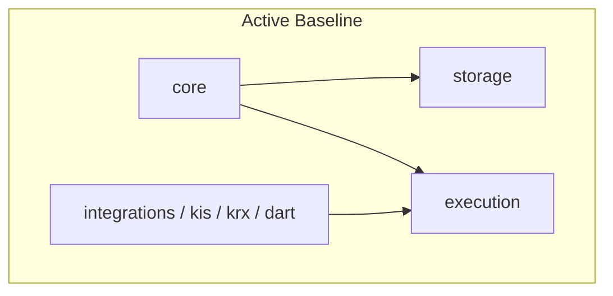

# 🚀 K-Stock Engine

[](https://www.python.org/)
[](#-시스템-아키텍처-system-architecture)
[](#-개발-및-품질-검증)

K-Stock Engine은 한국 주식 시장(KOSPI / KOSDAQ) 대상의 최소 실행 코어와 외부 거래소 연동을 제공하는 프로덕션 엔진입니다.

## 📌 목차

1. [핵심 설계 철학](#-핵심-설계-철학)
2. [시스템 아키텍처](#-시스템-아키텍처)
3. [디렉토리 구조](#-디렉토리-구조)
4. [활성/보관 경계](#-활성보관-경계)
5. [시작하기](#-시작하기)
6. [개발 및 품질 검증](#-개발-및-품질-검증)

## 💡 핵심 설계 철학

- **결정론적 코어**: `core`는 순수 도메인 계약과 시간 정책을 제공한다.
- **헥사고날 실행**: `execution`은 브로커 포트와 상태 저장소를 분리한다.
- **저장소 분리**: `storage`는 Parquet 입출력을 자산 중립적으로 검증한다.
- **전송 전용 통합**: `integrations`는 KIS, KRX, DART 원시 전송만 수행한다.

## 🏛 시스템 아키텍처



## 📂 디렉토리 구조

```
k-stock-engine/
├── data/                       # Parquet 저장소 (Git 제외)
├── docs/
│   ├── architecture/           # project_goals 등 활성 문서
│   └── specs/                  # 스킬 워크플로우 스펙
├── legacy/                     # 보관된 전략, 리서치, 과거 테스트, 문서, 도구
│   ├── stocks/                 # 주식 리서치 및 파이프라인 (보관)
│   ├── etfs/                   # ETF 전략 (보관)
│   ├── etf_v1/                 # 과거 ETF 구현체
│   ├── stock_yetirank_v1/      # 과거 주식 구현체
│   ├── live_yeti_v1/           # 라이브 전략 (보관, KIS 클라이언트는 integrations로 승격)
│   ├── config/                 # 전략 임계치 및 과거 데이터 경로
│   ├── tests/                  # 보관 테스트 (unit/integration, fixtures)
│   ├── docs/                   # code_map, decisions, results (보관)
│   └── tools/                  # 보관 도구
├── src/
│   ├── core/                   # PROJECT_ROOT, DATA_ROOT 등 최소 경로
│   ├── storage/                # Parquet 저장소 어댑터
│   ├── execution/              # 주문 실행 헥사고날 포트
│   └── integrations/
│       ├── kis/                # KisClient, KisCredentials (전송 전용)
│       ├── krx/                # KrxApiClient, KrxMarket
│       └── dart/               # DartApiClient
├── tests/
│   ├── unit/core
│   ├── unit/storage
│   ├── unit/execution
│   ├── integration/execution
│   └── unit/integrations
└── pyproject.toml
```

## 🗃 활성/보관 경계

- **Active**: `src/core`, `src/storage`, `src/execution`, `src/integrations/kis`, `src/integrations/krx`, `src/integrations/dart`, `tests/unit/core`, `tests/unit/storage`, `tests/unit/execution`, `tests/integration/execution`, `tests/unit/integrations`, `README.md`, `docs/architecture/project_goals.md`, `docs/specs`, `tools/agent_skills`, `tools/devops`
- **Archived**: 모든 전략, 리서치, 백테스트, 데이터 큐레이션, CLI, 과거 테스트, 결과, ADR, code-map은 `legacy/` 하위로 이동
- **호환성**: hard_cut — `src` 하위에 `stocks`, `etfs`, `legacy`가 존재하지 않으며 `legacy`는 최상위 importable 패키지

## ⚡ 시작하기

```bash
git clone https://github.com/KTHYEONG/k-stock-engine.git
cd k-stock-engine
uv sync
```

### 직접 모듈 호출 (통합 전송)

```bash
uv run python -m src.integrations.kis.client
uv run python -m src.integrations.krx.client
uv run python -m src.integrations.dart.client
```

보관 파이프라인은 `legacy/` 하위에서 명시적으로 실행:

```bash
uv run pytest legacy/tests -q
uv run python -m legacy.live_yeti_v1.yeti_runner --help  # 보관
```

## 🧪 개발 및 품질 검증

```bash
uv run ruff check src tests
uv run mypy src
uv run pytest tests/unit/core tests/unit/storage tests/unit/execution tests/integration/execution tests/unit/integrations -q
```

보관 테스트는 기본 탐색에서 제외되며 명시적 호출로만 실행: `uv run pytest legacy/tests`
