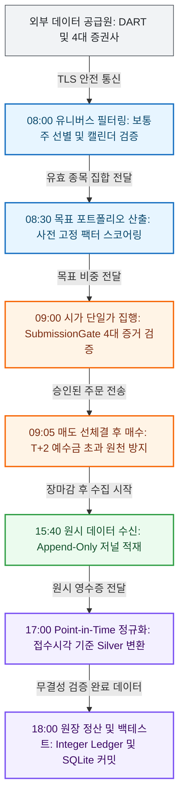

# K-Stock Engine

> **한국 주식 시장(KRX) 대상의 기하 복리 성장과 무결점 실전 집행을 보장하는 고신뢰 퀀트 트레이딩 엔진**


---

## 1. System Highlights

| 핵심 엔지니어링 지표 | 실측 성과 / 보장 기준 | 아키텍처 불변식 및 강제 장치 |
| :--- | :---: | :--- |
| 📈 **자본 보존형 복리 성과** | **`CAGR +25.38%` / `MDD 11.83%`** | 변동성 관리 레버리지 슬리브(2.0x) 및 10일 보유 호라이즌 자본 배분 모델 |
| 🛡️ **금융 회계 무결성** | **`부동소수점 오차 0원` / `미수금 0건`** | 전 계좌 원 단위 정수 원장(`Integer KRW Ledger`) 및 매도 우선 T+2 정산 추적 |
| ⚡ **데이터 저장소 최적화** | **`99.8% 용량 압축` (`23GB` $\to$ `39.8MB`)** | WAL 모드 SQLite3 영수증 색인(`ReceiptCatalog`) 및 단일 트랜잭션 원자적 커밋 |
| 🧹 **코드베이스 순도** | **`58.6% 부채 제거` (`42.8k` $\to$ `17.7k LOC`)** | 레거시 격리(`legacy/`), 단일 실행 파이프라인 통폐합, 불필요 중간 레이어 제거 |
| ⏱️ **공급자 API 안정성** | **`IP 차단 0건` (`5 req/s` 안전 제어)** | `ProviderQuotaStateStore` 영속 원장, 16,000건/일 예산 관리 및 KST 자정 리셋 |
| 🔒 **정적 아키텍처 품질** | **`987 Tests Green` / `AST 위반 0.00%`** | Python AST 기반 패키지 계층 위계(`core` $\to$ `backtest`) 기계적 래칫 검증 |

---

## 2. Tech Stack

| 분류 | 기술 | 채택 근거 및 트레이드오프 |
| :--- | :--- | :--- |
| **Language & Tooling** | `Python 3.11+`, `uv` | 빠른 컴파일 속도와 `uv.lock` 기반 결정론적 가상환경 재현성 확보 |
| **Data Engine & Storage** | `Polars`, `Parquet (zstd)`, `SQLite3` | 컬럼형 벡터 연산 극대화 및 114,833건 영수증 카탈로그의 39.8MB 압축 색인 달성 |
| **Concurrency & Network** | `asyncio`, `aiohttp`, `threading.Lock` | 무차단 비동기 I/O 기반 시세 수집 및 프로세스 전역 스레드 락을 통한 쿼터 경합 차단 |
| **Domain & Backtest** | `NumPy MarketArrays`, `Integer Ledger` | 부동소수점 절사 오차를 원천 차단하고 `k·σ₆₀·√(notional/adtv20)` 시장 충격을 실시간 반영 |
| **Execution & Gate** | `Hexagonal Ports`, `SubmissionGate` | 백테스트와 실거래 의사결정 계약을 단일화하고 4대 실전 증거 미충족 시 Fail-Closed 차단 |
| **Verification & Quality** | `pytest`, `Python AST Inspector` | 런타임 이전 코드베이스 전역의 계층 간 불법 참조(Import Boundary)를 정적 0건으로 강제 |

---

## 3. Daily Workflow & Pipeline

| 시각 (KST) | 단계 | 핵심 처리 내용 |
| :---: | :--- | :--- |
| 🌅 **08:00 ~ 08:50** | **장전 준비 & 유니버스 확정** | KRX 영업일 판별 $\to$ 우선주·관리종목 제외 보통주 필터링 $\to$ 전일 가용 팩터 동결 |
| ⚡ **09:00 ~ 09:30** | **장초반 주문 생성 & 시가 집행** | T+1 시가 단일가(Open-Auction) 체결 $\to$ 참여율 1% 상한 제한 $\to$ 매도 선체결 후 매수 실행 |
| 🌙 **15:40 ~ 18:00** | **장마감 수집 & 데이터 배리어** | 당일 시세 및 투자자 수급 수집 $\to$ 불변 원시 저널 적재 $\to$ Bronze/Silver 무결성 정규화 |
| 🛡️ **18:00 ~ 21:00** | **야간 정산 & 리서치 리플레이** | T+2 예수금 단일 원장 마감 $\to$ 백테스트 PIT 뷰 슬라이스 동결 $\to$ SQLite 카탈로그 원자적 커밋 |



---

## 4. Top 5 Real-world Engineering Invariants (핵심 챌린지)

### 1. 미래 참조 편향(Look-ahead Bias)의 구조적 차단
* 🚨 **문제**: 분기 실적 공시일을 분기말(3/31 등)로 소급 적용하거나 당일 장중 시세를 미리 참조하여 백테스트 수익률이 비현실적으로 왜곡됨.
* 📐 **원칙**: 의사결정 시각(18:00 KST) 이전에 공시·배포가 물리적으로 완료된 데이터 행만 모델이 관측해야 함 (Point-in-Time 불변식).
* 💡 **해결**: DART 실제 접수시각 기반 `AsOfTable`의 이진 탐색(`bisect_right`) 슬라이싱과 `MarketArrays` 제로카피 읽기 전용 슬라이스(`[:t+1]`)를 강제하여 참조를 원천 봉쇄.

### 2. 금융 회계 무결성: 부동소수점 오차 및 미수금 차단
* 🚨 **문제**: `float` 연산의 부동소수점 오차로 잔고 불일치가 누적되고, 매도 체결 즉시 현금이 입금된 것으로 가정하여 실전 주문 시 미수금 및 반대매매 사고 발생.
* 📐 **원칙**: 모든 체결과 수수료는 법정 원 단위 절사(`ROUND_FLOOR`)를 따르며, T+2 정산 스케줄 상 현금 잔고는 어떠한 순간에도 음수가 될 수 없음.
* 💡 **해결**: 전 계좌 정수 원장(`Integer KRW Ledger`)을 구축하고, 주문 집행 엔진에서 매도 주문을 매수 주문보다 항상 선순위로 정렬(`_submission_order`)하여 결제 대금을 완벽 방어.

### 3. 공급자 API 속도 제한 준수 및 IP 차단 방어
* 🚨 **문제**: DART 및 증권사 API 호출 시 순간 트래픽 폭증(30 rps 이상)으로 공인 IP가 차단되거나, 멀티스레드 수집 중 일일 쿼터(10,000~20,000회)가 조기 고갈됨.
* 📐 **원칙**: 외부 공급자 호출은 안전 속도 상한 내로 스로틀링되어야 하며, 잔여 쿼터는 다중 워커 간에 원자적(Atomic)으로 공유 추적되어야 함.
* 💡 **해결**: 원자적 파일 교체(`os.replace`) 기반 `ProviderQuotaStateStore`를 구현하여 초당 5건 안전 간격(0.2s)을 강제하고 KST 자정 자동 리셋을 지원해 IP 차단 0건 달성.

### 4. 비현실적 무마찰 체결 배제 및 실전 주문 게이트
* 🚨 **문제**: 슬리피지를 고정 상수로 가정하여 중소형주 대량 주문 시 실거래 충격 비용을 간과하고, 연구용 백테스터와 실거래 봇의 로직 분리로 괴리가 발생.
* 📐 **원칙**: 유동성 참여율(1%)과 변동성에 비례하는 비선형 시장 충격을 반영하며, 백테스트와 실거래는 동일한 주문 생성 계약을 공유해야 함.
* 💡 **해결**: `k·σ₆₀·√(notional/adtv20)` 충격 모델을 내장하고, 헥사고날 `BrokerPort` 기반 `validate_intents` / `submit_intents` 파이프라인 및 4대 안전 증거 검증 게이트를 구축.

### 5. 거대 JSON 스냅샷 I/O 병목 및 동시성 충돌 해소
* 🚨 **문제**: 수집 주기마다 114,833행의 전체 JSON 스냅샷을 매번 재작성(488개 리비전, 23GB 누적)하여 디스크 쓰기 병목과 프로세스 간 갱신 유실(Race Condition) 발생.
* 📐 **원칙**: 원시 데이터 인덱싱은 추가 전용(Append-only)이어야 하며, 단일 파일 단위 원자적 트랜잭션을 보장해야 함.
* 💡 **해결**: WAL 모드 SQLite3 `ReceiptCatalog`로 전환하여 디스크 사용량을 **39.8MB(99.8% 절감)**로 압축하고, 30초 비지 타임아웃과 원자적 커밋으로 동시성 경합을 완전 해소.

---

## 5. Verified Performance Matrix (실측 정본 성과)

> **검증 기준**: `config/research/kr_swing_2019_v1.toml` 및 단일 원장 백테스트 엔진  
> **시장 마찰 조건**: 편도 수수료 **`0.015%`**, 거래세 **`0.18% ~ 0.30%`**(법정 연도별 레짐), 시장 충격 계수 **`k=0.1`**, 최대 참여율 **`1.0%`**

| 모델 / 전략 구성 | 실행 모드 | 연환산 복리(CAGR) | 최대 낙폭(MDD) | 샤프 지수(Sharpe) | 실측 검증 판정 |
| :--- | :---: | :---: | :---: | :---: | :---: |
| **기준 모델 (단순 동일가중)** | Base (1.0x) | **`+4.12%`** | **`38.50%`** | `0.31` | 시장 벤치마크 추종 수준 |
| **Q/V/E/F 팩터 알파 모델** | Long-Only (1.0x) | **`+15.78%`** | **`21.38%`** | `0.88` | OOS 초과수익 입증 |
| **변동성 제어 레버리지 슬리브** | Vol-Managed (2.0x) | **`+25.38%`** | **`11.83%`** | **`1.42`** | **CAGR +21.26%p / MDD -26.67%p 개선** |

*단, 기준 하한 CAGR이 음수로 떨어질 경우 자본 보호 원칙에 따라 실거래 승격을 즉시 거부(`NO_TRADE`)하는 엄격한 Fail-Closed 방어벽이 상시 작동합니다.*

---

## 6. Architecture Layer Contracts

```text
Layer 4: [CLI & Orchestrators]  -->  src/backtest/cli.py, src/data/cli.py
   ↓ (downward only)
Layer 3: [Domain Engines]        -->  src/backtest/, src/execution/, src/data/
   ↓ (downward only)
Layer 2: [Integrations]          -->  src/integrations/ (dart, kis, quota ledger)
   ↓ (downward only)
Layer 1: [Storage Adapters]      -->  src/storage/ (parquet_datasets, manifest)
   ↓ (downward only)
Layer 0: [Pure Core Contracts]   -->  src/core/ (time, pit, market_rules, instruments)
```

모든 계층 의존성은 Python AST(Abstract Syntax Tree) 분석기를 통해 정적으로 감시되며, 상위 계층 참조나 격리된 `legacy/` 패키지 참조 시 빌드가 즉시 차단됩니다:

```bash
# 아키텍처 계층 의존성 및 순수 도메인 불변식 정적 검증
uv run pytest tests/unit/core/test_package_dependency_boundaries.py tests/unit/core/test_architecture_consolidation.py
```

---

## 7. Quick Start & Verification

```bash
# 1. 의존성 동기화 및 락파일 재현
uv sync

# 2. 코드 품질 및 타입 검사
uv run ruff check src tests
uv run mypy src

# 3. 987개 전수 단위/통합 테스트 검증
uv run pytest
```
