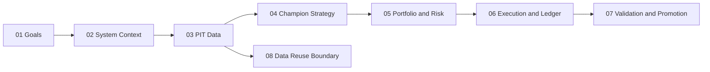

# K-Stock Compounding Engine Architecture

## Purpose

This directory is the canonical architecture view derived from `docs/plan.md`.
It separates stable system constraints from implementation sequencing. In-code
types and protocols remain the source of truth when code and documents differ.

## Document map

| Order | Document | Boundary |
| --- | --- | --- |
| 00 | This index | Reading order and dependency map |
| 01 | [Project goals](project_goals.md) | Objective, non-goals, global invariants |
| 02 | [System context](02_system_context.md) | Components, ownership, shared decision path |
| 03 | [Point-in-Time data](03_point_in_time_data.md) | Data tiers, schemas, availability, certification |
| 04 | [Champion strategy](04_champion_strategy.md) | Universe, Q/V/E/F signals, ranking |
| 05 | [Portfolio and risk](05_portfolio_and_risk.md) | Selection, hysteresis, sizing, exposure |
| 06 | [Execution and ledger](06_execution_and_ledger.md) | T+1 execution, fills, settlement, NAV truth |
| 07 | [Validation and promotion](07_validation_and_promotion.md) | OOS protocol, stress gates, live promotion |
| 08 | [Data reuse boundary](08_data_reuse_boundary.md) | Legacy data retention and removal decisions |

## Dependency topology

## Decision authority

1. Python types and protocols define executable contracts.
2. These documents define stable architectural constraints.
3. `docs/specs/*_contract.json` defines the single active implementation unit.
4. `docs/next/` defines ordered future work, not executable contracts.
5. `docs/plan.md` remains source material and is not an implementation contract.
