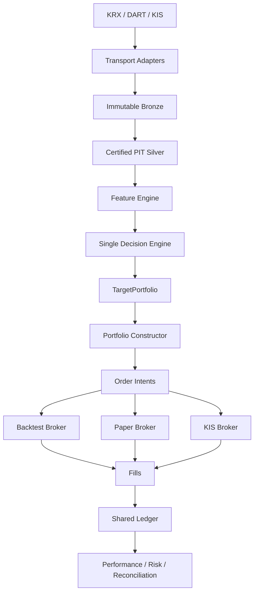
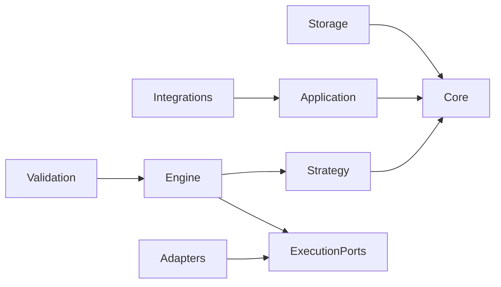

# System Context and Boundaries

## Topology



## Stable boundaries

| Boundary | Input | Output | Must not own |
| --- | --- | --- | --- |
| Integrations | Provider request | Raw response plus retrieval metadata | Domain policy, ranking, portfolio sizing |
| Storage | Immutable dataset and manifest | Validated bounded read | Asset selection or trading logic |
| Data | Raw observations | PIT-certified market snapshot | Alpha weights or order state |
| Features | PIT market snapshot | Versioned feature rows | Portfolio construction |
| Strategy | Snapshot and reconciled portfolio | Target portfolio | Broker behavior or fills |
| Portfolio | Ranked candidates and risk state | Constrained target weights | Alpha discovery or provider I/O |
| Execution | Target positions and broker state | Orders and fills | Feature calculation |
| Ledger | Fills, settlements, actions, marks | Cash, positions, costs, NAV | Forecasts or desired weights |
| Validation | OOS Ledger and experiment artifacts | PASS/FAIL verdict | Strategy mutation |

## Decision contract

The conceptual contract is:

```python
TargetPortfolio = strategy.decide(
    market_snapshot,
    portfolio_state,
)
```

The same strategy object receives historical or live implementations of the
snapshot and portfolio inputs. Environment-specific code ends at adapter and
broker boundaries.

## Active repository mapping

The target design reuses the current active foundations instead of recreating
equivalent abstractions.

| Target responsibility | Current reusable owner |
| --- | --- |
| Domain identity, costs, PIT time, portfolio state | `src/core/` |
| Manifest-validated Parquet I/O | `src/storage/parquet_datasets.py` |
| Order intents, ports, paper broker, submission gate | `src/execution/` |
| Provider transport | `src/integrations/{krx,dart,kis}/` |

New strategy, feature, engine, validation, and live orchestration modules are
introduced only by ordered contracts. Modern code must not import `legacy`.

## Dependency rule



Dependencies point toward pure contracts. `core` imports no provider,
strategy, storage, or execution package. Adapters may depend on ports, but
ports never depend on adapters.
