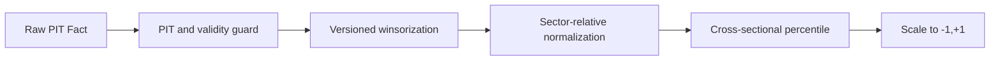

# Champion v1 Strategy

## Eligible universe

At each decision session, reconstruct securities alive and tradable at that
time. Champion v1 includes KOSPI and KOSDAQ common stocks and excludes
financials, ETF, ETN, REIT, SPAC, preferred shares, managed issues, suspended
issues, liquidation trading, and securities younger than 252 sessions.

Liquidity eligibility is:

$$
MedianTradingValue_{60} \ge 2{,}000{,}000{,}000\ KRW
$$

The threshold is a fixed baseline constant. Neighboring values are robustness
tests, not optimization candidates.

## Feature pipeline

The winsorization rule and sector taxonomy are immutable dataset-contract
inputs. A small sector cohort fails closed or uses an explicitly versioned
fallback; it is never silently pooled with the market.

## Profitability / Quality

$$
GP=\frac{GrossProfit}{Assets},\quad
ROE=\frac{NetIncome}{Equity},\quad
CFOA=\frac{OperatingCashFlow}{Assets}
$$

$$
Q=mean(rank(GP),rank(ROE),rank(CFOA))
$$

Zero or non-economic denominators make the component unavailable.

## Value

$$
V=\frac{rank(Book/Price)+rank(Earnings/Price)}{2}
$$

Negative or zero earnings makes `Earnings/Price` neutral rather than an
artificially extreme value. Book value and market capitalization must share a
valid PIT observation boundary.

## Earnings Momentum

$$
E_1=\frac{OI_q-OI_{q-4}}{Assets_{q-4}}
$$

$$
E_2=\frac{Sales_q-Sales_{q-4}}{Sales_{q-4}},\quad
E_3=Margin_q-Margin_{q-4}
$$

$$
E=mean(rank(E_1),rank(E_2),rank(E_3))
$$

Only filings available during the most recent 60 trading sessions contribute.
Corrections replace earlier facts only from their own `available_at` boundary.

## Foreign Flow

$$
F_5=\frac{\sum_{i=0}^{4}ForeignNetBuy_{t-i}}{ADTV_{20}},\quad
F_{20}=\frac{\sum_{i=0}^{19}ForeignNetBuy_{t-i}}{ADTV_{20}}
$$

$$
F=0.5\,rank(F_5)+0.5\,rank(F_{20})
$$

Nonpositive or unavailable `ADTV20` makes the factor unavailable.

## Final score

$$
Alpha=0.25Q+0.25V+0.25E+0.25F
$$

Champion eligibility requires all four factor scores. A future 3-of-4 neutral
fallback is a Challenger and cannot be enabled inside Champion v1.

## Decision cadence

- Signals freeze after session T data is available.
- Rebalance occurs every five KRX sessions.
- Execution starts no earlier than T+1.
- Price momentum, technical indicators, and ML outputs are not Champion inputs.
