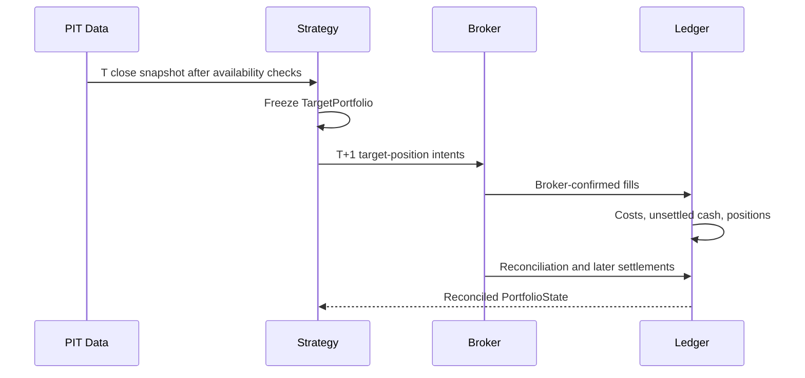

# Execution, Settlement, and Ledger

## Session sequence

T-close inputs may never fill at T close. Backtest, paper, and live brokers
share this timing rule.

## Broker boundary

| Input | Output |
| --- | --- |
| Validated target-position intent | Broker order identity |
| Canonical instrument and lot/tick rules | State transition |
| Reconciled current quantity | Confirmed fill quantity and price |
| Price/capacity guards | Reject reason or fill |

Sells are planned before buys. Unsettled sale proceeds are not spendable until
their settlement session. Duplicate idempotency keys and stale account
snapshots fail before submission.

## Fill model

Backtest fills start from next-session executable prices. Estimated one-way
execution cost separates spread and nonlinear impact:

$$
Participation=\frac{OrderNotional}{ADTV_{20}}
$$

$$
Impact \propto \sigma_i\sqrt{Participation}
$$

Ideal, Base, and Stress cost scenarios share statutory taxes and commissions.
Ideal has no market impact; Stress multiplies Base execution cost by two.
Promotion never uses Ideal results.

## Ledger journal

The Ledger accepts only immutable, uniquely identified events:

| Event | Required effects |
| --- | --- |
| Deposit/withdrawal | External settled-cash flow |
| Buy fill | Increase position; decrease settled cash by fill notional and explicit fees |
| Sell fill | Decrease position; create unsettled net proceeds until settlement |
| Settlement | Move due proceeds from unsettled to settled cash exactly once |
| Dividend | Add cash with source and entitlement identity |
| Split/merger | Apply explicit corporate-action quantity/cost-basis transformation |
| Mark | Value open positions without changing cash or quantity |

No short position, negative settled cash, duplicate fill, out-of-order event,
or unbalanced settlement is accepted.

## NAV truth

$$
NAV_t=SettledCash_t+UnsettledCash_t+\sum_i Quantity_{i,t}MarkPrice_{i,t}
$$

Commission and tax reduce cash. Slippage is represented by the confirmed fill
price relative to its reference price and is recorded analytically, never
subtracted twice. All performance reports derive from the Ledger journal and
marks; strategy code does not calculate an alternative return series.

## Event-driven backtest order

For each KRX session:

1. Settle due cash.
2. Apply effective corporate actions.
3. Execute pending orders.
4. Mark positions.
5. Persist and reconcile the Ledger.
6. On a decision session, build a PIT snapshot and freeze the next target.
