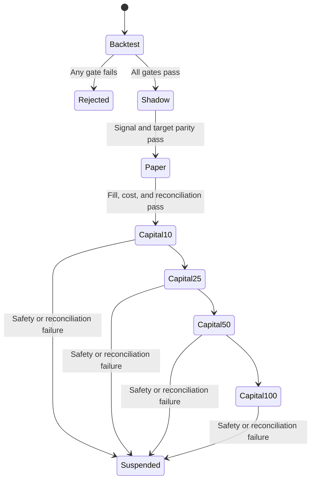

# Validation and Promotion

## OOS construction

Champion parameters are frozen before validation. Use expanding or rolling
five-year research windows followed by one-year OOS folds when coverage allows,
then concatenate every OOS Ledger into one out-of-fold equity curve.

Historical data already used for repeated research is not described as a
pristine holdout. Prospective shadow and paper data provides the final evidence.

## Metrics

| Group | Metrics |
| --- | --- |
| Growth | CAGR, annualized log growth |
| Risk | volatility, MDD, Calmar, Sortino |
| Relative | excess CAGR, Information Ratio |
| Stability | yearly, rolling one-year, and fold returns |
| Execution | turnover, cost drag, fill ratio, participation, capacity |

Two benchmarks are mandatory: eligible-universe cap weight and eligible-
universe equal weight.

## Promotion gates

| Gate | PASS condition |
| --- | --- |
| Data integrity | zero look-ahead, duplicate, unknown-action, survivorship, future-filing, and Ledger mismatch violations |
| OOS performance | Net CAGR exceeds benchmark by 3 percentage points; Sharpe at least 0.8; MDD at most 25%; Calmar at least 0.5 |
| Year stability | positive absolute years at least 70%; benchmark outperformance years at least 60% |
| Concentration | no single year explains at least 50% of compound alpha |
| Cost stress | Stress Net CAGR positive; benchmark outperformance is preferred |
| Parameter stability | neighboring N and rebalance settings retain at least 70% of baseline performance |
| Factor ablation | each Q/V/E/F removal is reported; hidden single-factor dependence is prohibited |

Thresholds are precommitments for Champion v1, not claims of universal optimality.

## Robustness protocol

- Evaluate rank IC, top-minus-bottom spreads, monotonicity, turnover, and decay for each factor.
- Use Moving Block or Stationary Bootstrap with 20-60-session blocks and at least 5,000 resamples.
- Evaluate N in `{15, 20, 25}` and rebalance cadence in `{4, 5, 10}` only as stability probes.
- Register every accepted and rejected experiment; failed experiments are never deleted.
- Apply multiple-testing correction when comparing a family of Challengers.

## Promotion state machine

Capital increases require explicit evidence. Backtest success alone never
authorizes live submission.

## Challenger rule

A Challenger uses identical data, folds, portfolio, execution, and costs. It
must increase OOS excess growth and Stress growth without unacceptable MDD or
turnover degradation. Otherwise it is rejected. Order: reversal, price
momentum, short interest, then ElasticNet and LightGBM.
