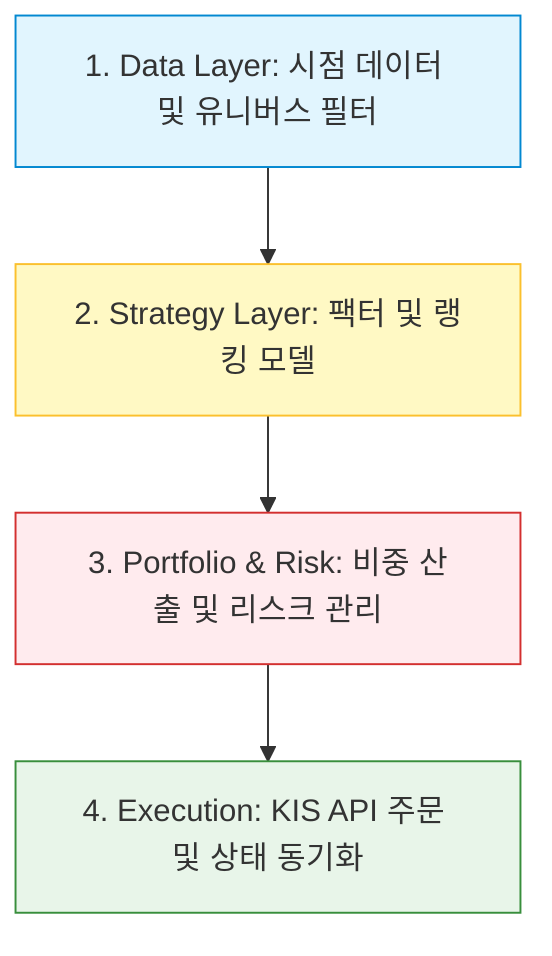

# 🎯 K-Stock Engine 프로젝트 개요 및 운용 목표 (Project Goals & System Context)

## 1. 📌 프로젝트 개요 (Overview)

- **프로젝트명**: K-Stock Engine
- **핵심 목표**: 국내 주식(KOSPI / KOSDAQ) 자동매매를 통한 장기적 복리 자산 증식 (Compound Wealth Growth)
- **운용 대상**: 대한민국 거래소 상장 주식 및 ETF
- **운용 시드 규모**: **1,000만 원 이하 (소액/소형 자본 환경)**
- **주요 운용 주기**: 일봉(Daily) 기반 포지션/스윙 트레이딩 및 시장 국면별 동적 현금 비중 조절

---

## 2. 💡 소액 시드(1,000만 원 이하) 운용 환경 정보

### 1) 포트폴리오 규모 및 종목 수
- 자본금 1,000만 원 이하 환경에서는 종목당 할당 금액과 주가(1주당 가격) 사이의 정수 단위(Integer Share) 라운딩 오차가 발생합니다.
- 통상 3 ~ 7종목 내외의 바스켓 구성이 1주 단위 체결 오차를 완화하고 실질적인 포트폴리오 비중을 유지하기에 적합한 구조입니다.

### 2) 거래비용 및 회전율 특성
- 국내 주식 거래 시 증권거래세(0.15%~0.20%), 위탁 수수료, 호가 스프레드 및 슬리피지가 발생합니다.
- 포트폴리오 회전율이 지나치게 높을 경우 누적 거래비용이 복리 수익률에 큰 영향을 미치므로, 명확한 추세 및 진입 근거가 확보된 구간을 중심으로 포지션을 전환하는 것이 효율적입니다.

### 3) 복리 자산 증식과 리스크 관리
- 장기 복리 수익률 극대화를 위해 최대 낙폭(MDD) 방어와 하방 리스크 관리가 핵심 요소입니다.
- 시장 급락기나 위험 국면에서는 현금(Cash) 비중을 유연하게 확대(`NO_TRADE` / `DE_RISK`)하여 자산을 보호할 수 있는 구조를 전제로 합니다.

---

## 3. 🧱 시스템 아키텍처 및 계층별 구성

### 계층별 주요 역할
- **Data Layer (`src/stocks/data`)**: Point-in-Time 기준 시점 무결성 보장, 결측치 및 거래정지/관리종목 필터링, ADTV(일평균 거래대금) 기반 유니버스 선별.
- **Strategy & Research Layer (`src/stocks/research`)**: 상대강도(모멘텀), 거래대금, 기술적 지표 및 머신러닝 기반 종목 랭킹 산출, 시장 추세 필터.
- **Portfolio & Risk Layer (`src/stocks/trading`)**: 3~7종목 포트폴리오 비중 산출, 정수 주식 수 환산, 개별 손절 및 트레일링 스탑, 현금 보유 모드 제어.
- **Execution Layer (`src/execution`)**: 한국투자증권(KIS) OpenAPI 연동, 멱등성 키(`idempotency_key`) 기반 중복 주문 방지 및 실제 체결/예수금 상태 동기화.
