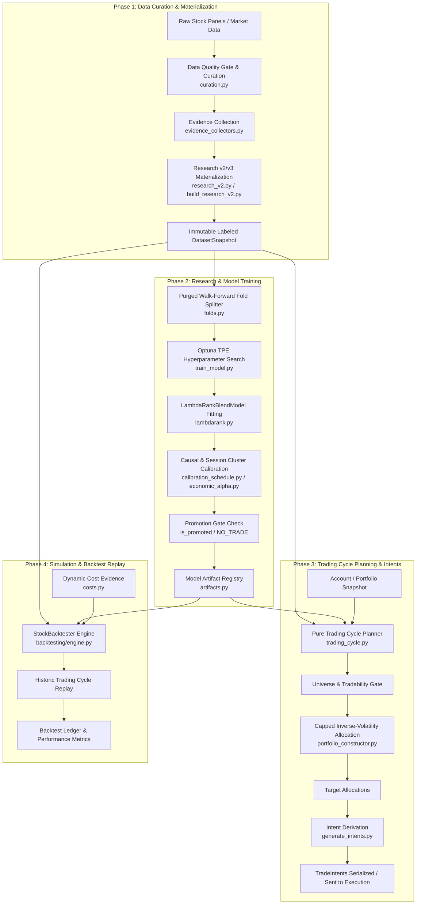
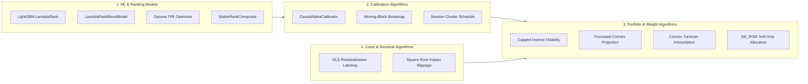
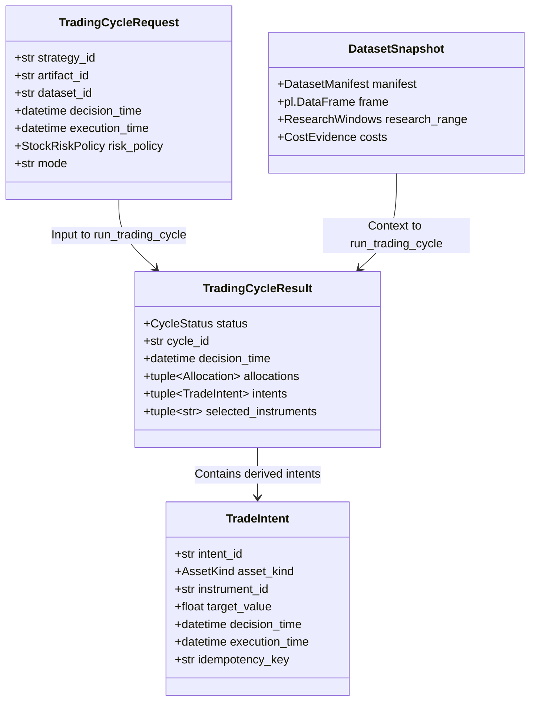

# K-Stock Engine (Stocks Module) 메인 로직 흐름 및 아키텍처 명세서

이 문서는 `k-stock-engine`의 주식 알파 파이프라인(`src/stocks`)의 전체 메인 로직 흐름, 모듈 구성, 주요 사용 모델 및 알고리즘 명세, 데이터 계약(Data Contracts), 리스크 관리 및 포트폴리오 가드레일, 백테스트 및 실전 거래 실행 구조를 상세하고 이해하기 쉽게 설명합니다.

---

## 1. 개요 및 핵심 아키텍처 철학

`src/stocks` 파이프라인은 한국 주식 시장(K-Stock)을 대상으로 한 머신러닝 기반 정교한 퀀트 알파 발굴, 포트폴리오 구성, 위험 관리, 리플레이(시뮬레이션) 및 실전 트레이딩 사이클을 처리합니다.

### 핵심 설계 원칙 (Design Principles)

1. **결정론적 Pure Planner 철학 (Deterministic & Side-Effect Free)**
   - 거래 사이클 플래너([`run_trading_cycle`](file:///home/kth/k-stock-engine/src/stocks/workflows/trading_cycle.py#L116-L210))는 완전한 순수 함수(Pure Function)로 작동합니다. 브로커 호출, 파일 시스템 쓰기, 네트워크 I/O 등의 부작용(Side Effect)이 일절 없으며, 통제된 데이터 스냅샷과 계좌 현황을 입력받아 불변의결과([`TradingCycleResult`](file:///home/kth/k-stock-engine/src/stocks/workflows/trading_cycle.py#L86-L114))를 반환합니다.
2. **엄격한 데이터 시점 보장 (Point-in-Time Integrity)**
   - 미래 데이터 누수(Look-ahead bias)를 근본적으로 차단하기 위해 `available_time <= decision_time` 필터링 및 자동 레이블 컬럼 제거([`_drop_label_columns`](file:///home/kth/k-stock-engine/src/stocks/workflows/trading_cycle.py#L242-L256))를 강제합니다.
3. **Purged & Embargoed Walk-Forward 모델 검증**
   - 금융 타임시리즈의 자기상관성(Autocorrelation)으로 인한 오버피팅을 방지하고자 데이터 분할 시 Purge 구간과 Embargo 구간을 둔 분기별(Quarterly) 확장 Walk-Forward 분할 구조를 채택하고 있습니다.
4. **동일 코드 재활용 (Replay & Live Symmetry)**
   - 백테스트 및 시뮬레이션([`StockBacktester`](file:///home/kth/k-stock-engine/src/stocks/backtesting/engine.py))과 실전 플래닝([`run_trading_cycle`](file:///home/kth/k-stock-engine/src/stocks/workflows/trading_cycle.py))이 정확히 동일한 로직과 포트폴리오 생성기([`construct_target_allocations`](file:///home/kth/k-stock-engine/src/stocks/trading/portfolio_constructor.py#L171-L175))를 공유합니다.

---

## 2. 파이프라인 전체 워크플로우 (End-to-End Workflow Diagram)

### 엔드-투-엔드 데이터 및 처리 흐름



### CLI 명령어 vs 파이프라인 모듈 매핑

| CLI 명령어 | 주 파이프라인 모듈 | 역할 및 기능 |
| :--- | :--- | :--- |
| `python -m src.stocks.cli.curate` | [`src/stocks/data/curation.py`](file:///home/kth/k-stock-engine/src/stocks/data/curation.py) | 주가/재무/유니버스 원천 데이터의 품질 검증 및 정제 |
| `python -m src.stocks.cli.collect_evidence` | [`src/stocks/data/evidence_collectors.py`](file:///home/kth/k-stock-engine/src/stocks/data/evidence_collectors.py) | 시장 증거(거래량, 거래대금, 가용시간 등) 수집 |
| `python -m src.stocks.cli.build_research_v2` | [`src/stocks/data/research_v2.py`](file:///home/kth/k-stock-engine/src/stocks/data/research_v2.py) | 알파 피처(`stock_alpha_v2`/`v3`) 및 Residual Label 산출, 스냅샷 릴리즈 |
| `python -m src.stocks.cli.train` | [`src/stocks/workflows/train_model.py`](file:///home/kth/k-stock-engine/src/stocks/workflows/train_model.py) | Purged Walk-Forward + Optuna 튜닝으로 `LambdaRankBlendModel` 학습 및 승진 검증 |
| `python -m src.stocks.cli.intents` | [`src/stocks/workflows/trading_cycle.py`](file:///home/kth/k-stock-engine/src/stocks/workflows/trading_cycle.py) | 순수 트레이딩 사이클 실행 및 최종 주문 의도(`TradeIntent`) 생성 |
| `python -m src.stocks.cli.simulate` | [`src/stocks/workflows/simulate_portfolio.py`](file:///home/kth/k-stock-engine/src/stocks/workflows/simulate_portfolio.py) | 알파 모델을 과거 데이터 상에서 동적 비용 모델과 함께 백테스트 리플레이 실행 |

---

## 3. 단계별 상세 메인 로직 흐름

### Phase 1: 데이터 큐레이션 및 리서치 스냅샷 구축

데이터 큐레이션 과정은 원천 시장 데이터로부터 불변(Immutable) 연구용 스냅샷을 구성하는 단계입니다.

1. **품질 검증 및 큐레이션 ([`curation.py`](file:///home/kth/k-stock-engine/src/stocks/data/curation.py))**
   - 주가 OHLCV 데이터의 이상치(주가 0 이하, 고가 < 저가 등), 거래정지, 상장폐지 일자, 데이터 결측을 검증합니다.
   - 유효 종목에 대해 `data_quality_status == 'eligible'` 상태를 부여합니다.
2. **증거 수집 ([`evidence_collectors.py`](file:///home/kth/k-stock-engine/src/stocks/data/evidence_collectors.py))**
   - 시점별 가용 시간(`available_time`), 세금 및 수수료 스케줄, 거래대금(ADTV), 섹터 분류 증거 데이터를 동기화합니다.
3. **특징량(Features) 및 레이블(Labels) 구동 ([`research_v2.py`](file:///home/kth/k-stock-engine/src/stocks/data/research_v2.py))**
   - **Feature Set (`stock_alpha_v2` / `v3`)**: 기술적 지표, 모멘텀, 변동성, 팩터 상대 점수 등 수십 종의 표준화된 피처 계산.
   - **Residual Labels**: 단순 수익률이 아닌 섹터/시장 효과가 제거된 잔차 수익률(Residual Return) 기반 5Session / Multi-horizon 타겟 레이블 계산.
   - 메타데이터 매니페스트([`DatasetManifest`](file:///home/kth/k-stock-engine/src/core/datasets.py))와 함께 불변 [`DatasetSnapshot`](file:///home/kth/k-stock-engine/src/stocks/data/contracts.py)으로 저장됩니다.

---

### Phase 2: 연구 및 모델 학습 (Research & Model Training)

학습 워크플로우([`train_model.py`](file:///home/kth/k-stock-engine/src/stocks/workflows/train_model.py))는 랭킹 모델을 최적화하고 최종 승진 검증을 수행합니다.

```
+-----------------------------------------------------------------------------+
|                         Purged Walk-Forward Folds                           |
|  [ Outer Fold 1: Train  | Purge | Val  | Embargo | Test ]                  |
|  [ Outer Fold 2: Train-------> | Purge | Val | Embargo | Test ]             |
|  [ Outer Fold 3: Train--------------> | Purge | Val | Embargo | Test ]      |
+-----------------------------------------------------------------------------+
                                       │
                                       ▼
+-----------------------------------------------------------------------------+
|               Optuna TPE Hyperparameter Tuning (Serial Trials)               |
|  - Objective: Backtest Sharpe Ratio / NDCG @ Top-K                          |
|  - Model: LambdaRankBlendModel (LightGBM + StableRank Composite)           |
+-----------------------------------------------------------------------------+
                                       │
                                       ▼
+-----------------------------------------------------------------------------+
|                     Causal Alpha & Calibration                              |
|  - CausalAlphaCalibrator & SessionClusterCalibrationSchedule                |
|  - Converts raw LambdaRank scores into expected active/net alpha            |
+-----------------------------------------------------------------------------+
                                       │
                                       ▼
+-----------------------------------------------------------------------------+
|                      Promotion Gate Evaluation                              |
|  - Checks OOS Return, Drawdown, Turnover & Base/Stress Cost Gates           |
|  - Pass -> Promoted Champion Artifact  / Fail -> NO_TRADE Artifact         |
+-----------------------------------------------------------------------------+
```

1. **Purged Walk-Forward Cross-Validation ([`folds.py`](file:///home/kth/k-stock-engine/src/stocks/research/folds.py))**
   - 시계열 중첩을 방지하기 위해 훈련(Train)과 검증(Validation) 사이의 데이터 파지(Purge) 및 미반영(Embargo) 기간을 적용합니다.
2. **LambdaRank 머신러닝 모델 ([`lambdarank.py`](file:///home/kth/k-stock-engine/src/stocks/research/lambdarank.py))**
   - 주식 간 상대 순위를 예측하기 위해 LightGBM 기반의 LambdaRank objective 사용.
   - 단일 모델 오버피팅 방지를 위해 여러 파라미터 조합의 블렌딩([`LambdaRankBlendModel`](file:///home/kth/k-stock-engine/src/stocks/research/lambdarank.py)) 구성.
3. **인과적 캘리브레이션 ([`calibration_schedule.py`](file:///home/kth/k-stock-engine/src/stocks/research/calibration_schedule.py), [`economic_alpha.py`](file:///home/kth/k-stock-engine/src/stocks/research/economic_alpha.py))**
   - 모델이 출력한 상대 랭킹 점수(Score)를 실제 예상 초과 수익률(Expected Active Alpha) 및 비용 차감 후 수익률(Expected Net Alpha)로 변환합니다.
4. **승진 게이트 (Promotion Gate)**
   - 과거 OOS 성능, 스트레스 비용 하에서의 샤프 지수, 회전율(Turnover) 제약 조건을 모두 만족해야 `promoted = true` 자격을 얻습니다. 기준 미달 시 `NO_TRADE` 아티팩트가 생성되어 트레이딩 중단을 보장합니다.

---

### Phase 3: 트레이딩 사이클 플래닝 및 포트폴리오 구성

플래닝 워크플로우([`trading_cycle.py`](file:///home/kth/k-stock-engine/src/stocks/workflows/trading_cycle.py))는 시점별 데이터와 승진된 아티팩트를 사용하여 Target Position을 도출합니다.

#### 주요 처리 단계 (Fixed Step Order):

1. **시점 데이터 준비 및 서명 검증**:
   - `available_time <= decision_time` 필터링 적용.
   - 레이블 관련 모든 컬럼 완전 제거 (`_drop_label_columns`).
2. **유니버스 및 거래 가능 여부 필터링 (`_universe_gate`)**:
   - `data_quality_status == 'eligible'`
   - `is_universe == True`
   - `tradable == True`
3. **모델 추론 (Model Scoring)**:
   - 승진된 아티팩트 로드 및 입력 데이터 판판 스코어링 (`pred_score`).
4. **포트폴리오 비중 배분 ([`portfolio_constructor.py`](file:///home/kth/k-stock-engine/src/stocks/trading/portfolio_constructor.py))**:
   - **Score 기반 Top-K 종목 선택**: 최상위 $K$개 종목 필터링.
   - **Inverse-Volatility Weighting**: 종목별 수익률 변동성 역수에 비례하여 기본 비중 부여.
   - **제약 조건(Constraints) 적용**:
     - 종목별 최대 보유 한도 (`single_name_cap`, 예: 10%)
     - 전체 주식 노출 한도 (`gross_cap`, 예: 100%)
     - 섹터별 최대 노출 한도 (`sector_cap`)
     - 일평균 거래대금 대비 한도 (`participation_limit`, liquidity cap)
   - **턴오버 보간 및 DE_RISK 조치**:
     - 기존 포트폴리오의 제약 위반 시 안전하게 매도만 수행하는 `DE_RISK` 플랜 작동.
5. **TradeIntent 도출 ([`generate_intents.py`](file:///home/kth/k-stock-engine/src/stocks/workflows/generate_intents.py))**:
   - 목표 비중(Target Allocation)과 현재 보유 계좌 상태([`PortfolioSnapshot`](file:///home/kth/k-stock-engine/src/core/portfolio.py))를 비교하여 매수/매도/청산 매매 의도([`TradeIntent`](file:///home/kth/k-stock-engine/src/execution/domain/intents.py)) 산출.

---

### Phase 4: 시뮬레이션 및 백테스팅 엔진 (Simulation & Backtest Replay)

백테스터 엔진([`backtesting/engine.py`](file:///home/kth/k-stock-engine/src/stocks/backtesting/engine.py))은 과거 모든 거래 세션에 대해 Phase 3의 순수 플래너를 재실행합니다.

1. **시간 순서 리플레이 (Chronological Event Loop)**
   - 의사결정 시점($T_{decision}$)마다 유효한 모델 아티팩트 선택.
   - Pure Planner를 호출하여 타겟 비중 산출.
2. **동적 비용 모델 적용 ([`costs.py`](file:///home/kth/k-stock-engine/src/stocks/data/costs.py))**
   - **슬리피지(Slippage)**: 거래대금 대비 체결 금액 비율에 따른 동적 유동성 슬리피지 계산.
   - **거래세 및 수수료**: 한국 주식 시장 유가증권/코스닥 거래세(Statutory tax rate) 및 증권사 수수료 차감.
3. **원장(Ledger) 업데이트 및 성과 평가**
   - 현금, 보유 수량, 평가 금액, 일별 수익률, Drawdown, Sharpe, Turnover 기록 및 최종 `BacktestResult` 반환.

---

## 4. 주요 적용 모델 및 알고리즘 명세 (Models & Algorithms Specification)

본 파이프라인 전반에 적용된 머신러닝 모델, 앙상블 기법, 최적화 알고리즘 및 수학적 캘리브레이션 모델들의 상세 기술 명세입니다.



### 1) 머신러닝 & 랭킹 모델 (Machine Learning & Ranking Models)

* **LightGBM LambdaRank (`LGBMRanker`)**:
  * **알고리즘**: Pairwise 및 Listwise Gradient Boosted Decision Trees (GBDT) 기반 Learning-to-Rank 알고리즘.
  * **목적 함수 (Objective)**: `lambdarank` (NDCG@K 지표를 직접 최적화하도록 기울기 및 헤시안 계산).
  * **Query Group 구성**: 거래 세션(`session`)을 그룹 키로 지정하여 횡단면 종목 간의 상대적인 순위(Ranking)를 직접 학습.
  * **구현 파일**: [`src/stocks/research/lambdarank.py`](file:///home/kth/k-stock-engine/src/stocks/research/lambdarank.py)

* **`LambdaRankBlendModel` (앙상블 & 블렌딩 랭커)**:
  * **알고리즘**: 서로 다른 트리 깊이(`max_depth`), 학습률(`learning_rate`), 피처 하위 집합 비율(`feature_fraction`)을 적용하여 다중 시드(Multi-seed)로 학습한 복수의 LightGBM 랭킹 모델들의 예측 스코어를 가중 결합(Weighted Ensemble Blend).
  * **효과**: 단일 결정 트리의 과적합(Overfitting)을 억제하고 표본 외(OOS) 데이터에서의 랭킹 예측 안정성을 보장.

* **Optuna TPE (Tree-structured Parzen Estimator) 하이퍼파라미터 최적화**:
  * **알고리즘**: 베이지안 확률 모델에 기반한 하이퍼파라미터 탐색 알고리즘.
  * **목적 함수**: Purged Walk-Forward 검증 세트에서의 Sharpe Ratio 및 Top-K NDCG 최적화.
  * **구현 파일**: [`src/stocks/workflows/train_model.py`](file:///home/kth/k-stock-engine/src/stocks/workflows/train_model.py)

* **`StableRankComposite` (팩터 기반 복합 랭킹 모델)**:
  * **알고리즘**: 개별 알파 팩터들에 대해 Moving-block Bootstrap 및 Quantile Winsorization을 거쳐 Rank IC를 정밀 추정하고, $95\%$ 신뢰구간 하한이 정(+)인 유효 팩터만을 선별한 뒤 횡단면 랭크 정규화(Rank Normalization) 복합 스코어를 산출.
  * **구현 파일**: [`src/stocks/research/models.py`](file:///home/kth/k-stock-engine/src/stocks/research/models.py)

---

### 2) 알파 캘리브레이션 알고리즘 (Alpha Calibration Algorithms)

* **`CausalAlphaCalibrator` (인과적 알파 캘리브레이터)**:
  * **알고리즘**: Raw LambdaRank Score Percentile을 실제 예상 초과 수익률($\mathbb{E}[\text{Active Alpha}]$) 및 비용 차감 후 Net Alpha로 수치 변환.
  * **수학적 축소 및 윈저화 (Shrinkage & Moving-Block Bootstrap)**:
    - 표본 오차 감소를 위해 버킷별 평균 수익률을 과거 전체 역사 평균으로 축소(Shrinkage) 조정.
    - Moving-block Bootstrap resampling으로 $95\%$ 신뢰구간 하한($\text{Alpha Lower Bound}$) 산출.
    - 신뢰구간 하한이 $0$ 이하이거나 과거 표본이 부족한 경우 매수 신호 불가(`null`)로 간주하여 자동 현금화/매도 유도.
  * **구현 파일**: [`src/stocks/research/economic_alpha.py`](file:///home/kth/k-stock-engine/src/stocks/research/economic_alpha.py)

* **`SessionClusterCalibrationSchedule`**:
  * **알고리즘**: 시장 국면(Market Regime) 및 변동성 클러스터에 맞춰 시점 분리(Point-in-Time) 조건하에 최적의 캘리브레이션 파라미터를 동적 적용.
  * **구현 파일**: [`src/stocks/research/calibration_schedule.py`](file:///home/kth/k-stock-engine/src/stocks/research/calibration_schedule.py)

---

### 3) 포트폴리오 비중 배분 및 최적화 알고리즘 (Portfolio Allocation & Optimization Algorithms)

* **Capped Inverse-Volatility Weighting (역변동성 가중 알고리즘)**:
  * **알고리즘**: 상위 Top-K 선정 종목들의 수익률 일간 변동성 $\sigma_i$를 추정하고 변동성의 역수에 비례하는 비중 산출.
  * **수학식**:
    \[ w_i^{\text{raw}} = \frac{1 / \sigma_i}{\sum_{j \in \text{TopK}} (1 / \sigma_j)} \]

* **Truncated Convex Constraint Projection (볼록 제약 투영 최적화 알고리즘)**:
  * **알고리즘**: 아래 4가지 하드 제약 조건을 동시에 완벽히 충족하도록 반복 절단 및 스케일링 투영(Iterative Truncation Projection) 알고리즘 수행:
    1. **Single-Name Cap**: $w_i \le \text{single\_name\_cap}$ (단일 종목 한도)
    2. **Gross Exposure Cap**: $\sum w_i \le \text{gross\_cap}$ (전체 주식 노출 한도)
    3. **Sector Exposure Cap**: $\sum_{i \in \text{Sector}_k} w_i \le \text{sector\_cap}$ (섹터 한도)
    4. **Liquidity Cap**: $\text{Notional}_i \le \text{participation\_limit} \times \text{ADTV}_i$ (유동성 체결 한도)
  * **구현 파일**: [`src/stocks/trading/portfolio_constructor.py`](file:///home/kth/k-stock-engine/src/stocks/trading/portfolio_constructor.py)

* **Convex Turnover Interpolation (턴오버 보간 알고리즘)**:
  * **알고리즘**: 현재 포트폴리오 비중 $w_{\text{current}}$에서 목표 비중 $w_{\text{target}}$으로 이행할 때, 과도한 매매 비용 및 슬리피지 방지를 위해 턴오버 제약범위 내에서 볼록 조합(Convex Combination)으로 비중 이행.

* **`DE_RISK` Sell-Only Allocation (리스크 해제 매도 전용 알고리즘)**:
  * **알고리즘**: 포트폴리오 제약 조건 위반 또는 위험 경보 시, 신규 매수 비중을 $0$으로 한정하고 보유 종목의 축소 및 매도 청산만 안전하게 허용.

---

### 4) 시계열 분할 및 교차 검증 알고리즘 (Validation Algorithms)

* **Purged & Embargoed Cross-Validation Splitter**:
  * **알고리즘**: 타임시리즈 데이터 누수(Data Leakage)를 원천 차단하는 검증 분할 알고리즘.
  * **Purge Window**: $\text{Purge} \ge \text{Label Horizon}$ (레이블 수평선 중첩 완벽 제거).
  * **Embargo Window**: $\text{Embargo} \ge \text{Gap}$ (검증 세트 직후 시계열 관련성 차단).
  * **구현 파일**: [`src/stocks/research/folds.py`](file:///home/kth/k-stock-engine/src/stocks/research/folds.py)

---

### 5) 동적 시장 충격 & 거래 비용 알고리즘 (Dynamic Market Impact & Transaction Cost Models)

* **Square-Root Market Impact Slippage Model (제곱근 시장 충격 모델)**:
  * **알고리즘**: 주문 대금 및 일평균 거래대금(ADTV) 비율과 종목 변동성을 반영한 제곱근 슬리피지 알고리즘.
  * **수학식**:
    \[ \text{Slippage}_i = c_0 + c_1 \cdot \left( \frac{\text{Order Notional}_i}{\text{ADTV}_i} \right)^\gamma \cdot \sigma_i \]
    ($c_0$: 고정 수수료/스프레드, $c_1, \gamma \approx 0.5$: 시장 충격 계수)

* **Statutory Tax & Fee Engine**:
  * 한국 증권거래세율(유가증권/코스닥) 및 증권사 매매 수수료 자동 차감 반영.
  * **구현 파일**: [`src/stocks/data/costs.py`](file:///home/kth/k-stock-engine/src/stocks/data/costs.py)

---

### 6) 피처 엔지니어링 및 레이블 알고리즘 (Feature & Labeling Algorithms)

* **OLS Residualization Labeling (잔차 수익률 추출 알고리즘)**:
  * **알고리즘**: 개별 종목 수익률 $R_{i,t}$를 시장 벤치마크 수익률 $M_t$ 및 섹터 수익률 $S_{k,t}$에 대해 OLS 회귀하여 잔차 알파 $\epsilon_{i,t}$ 도출:
    \[ R_{i,t} = \alpha_i + \beta_i M_t + \gamma_i S_{k,t} + \epsilon_{i,t} \]
  * **구현 파일**: [`src/stocks/research/labels.py`](file:///home/kth/k-stock-engine/src/stocks/research/labels.py)

* **Cross-Sectional Quantile Winsorization & Z-Score Normalization**:
  * 이상치(Outliers) 윈저화(상/하위 $1\%$) 및 세션 단위 횡단면 정규화.
  * **구현 파일**: [`src/stocks/research/features.py`](file:///home/kth/k-stock-engine/src/stocks/research/features.py)

---

## 5. 핵심 데이터 계약 (Data Contracts & Invariants)

파이프라인 전반에서 데이터 타입 안전성과 결정론적 검증을 위해 사용되는 주요 불변 계약 객체들입니다.



### 무결성 불변 조건 (System Invariants)
- **No-Label Invariant**: 트레이딩 사이클 플래너에 입력되는 DataFrame에는 레이블 컬럼(`target_*`, `label_*`, `residual_*` 등)이 존재할 수 없습니다.
- **Idempotency Key**: 모든 생성된 `TradeIntent`는 `strategy_id:instrument_id:date` 조합으로 생성되는 고유한 멱등성 키(`idempotency_key`)를 가집니다.
- **Mode Strictness**: `mode="live"` 실행 시 provisional 스냅샷이나 unpromoted 아티팩트 사용 시 즉시 `TradingCycleNotReadyError` 예외를 발생시킵니다.

---

## 6. 리스크 관리 및 포트폴리오 가드레일 (Risk Guardrails)

[`StockRiskPolicy`](file:///home/kth/k-stock-engine/src/stocks/trading/portfolio_constructor.py#L34) 객체를 통해 다중 레이어의 위험 방어벽을 구축합니다.

1. **Top-K Selection Cap**: 상위 $K$개 종목만 선택하여 포트폴리오 과다 분산 방지.
2. **Single-Name Weight Cap**: 단일 종목 최대 투자 비중 제한 (예: 10%).
3. **Gross Exposure Cap**: 총 주식 보유 비중 상한 설정 (예: 100%).
4. **Sector Exposure Limit**: 특정 산업 섹터에 대한 과도한 쏠림 방지.
5. **Liquidity Participation Limit**: 일평균 거래대금(ADTV)의 일정 비율(예: 1%~2.5%) 이상을 초과하지 않도록 수량 제한.
6. **DE_RISK 모드**: 시장 이상 현상이나 제약 조건 이탈 시 매수는 전면 중단하고 안전하게 비중 축소 및 청산 매도만 수행.

---

## 7. 코드베이스 디렉토리 구조 맵 (Codebase Layout)

주식 파이프라인(`src/stocks/`)의 전체 파일 구조는 역할에 따라 다음과 같이 깔끔하게 분리되어 있습니다:

```
src/stocks/
├── backtesting/               # 백테스팅 및 리플레이 엔진
│   └── engine.py              # StockBacktester 핵심 이벤트 루프
├── cli/                       # 파이프라인 단계별 CLI 진입점
│   ├── build_research_v2.py   # v2/v3 스냅샷 생성 CLI
│   ├── collect_evidence.py    # 데이터 증거 수집 CLI
│   ├── curate.py              # 데이터 정제 CLI
│   ├── intents.py             # 트레이딩 사이클 / Intent 생성 CLI
│   ├── simulate.py            # 시뮬레이션 백테스트 CLI
│   └── train.py               # 모델 학습 CLI
├── data/                      # 데이터 수집, 정제, 스냅샷, 동적 비용 계약
│   ├── catalog.py             # 스냅샷 카탈로그 관리
│   ├── contracts.py           # DatasetSnapshot 등 데이터 계약
│   ├── costs.py               # 동적 슬리피지/세금/비용 모델
│   ├── curation.py            # 품질 검증 및 유니버스 필터
│   ├── evidence_collectors.py # 증거 데이터 수집기
│   ├── feature_contracts.py   # 피처 계약 정의
│   ├── labels.py              # 잔차 레이블 산출
│   ├── repositories.py        # 저장소 및 스냅샷 리졸버
│   └── research_v2.py         # v2 스냅샷 생성 핵심 로직
├── domain/                    # 도메인 개체
│   └── universe.py            # 종목 유니버스 정의
├── research/                  # 머신러닝, 피처, 레이블, 검증 분할, 모델 정의
│   ├── artifacts.py           # 모델 아티팩트 레지스트리
│   ├── calibration_schedule.py# 알파 캘리브레이션 스케줄
│   ├── economic_alpha.py      # 알파 캘리브레이터
│   ├── features.py            # stock_alpha_v2 피처 생성
│   ├── folds.py               # Purged Walk-Forward 분할기
│   ├── labels.py              # 레이블 정의 및 타겟 계산
│   ├── lambdarank.py          # LambdaRankBlendModel 및 LightGBM 피팅
│   └── models.py              # 모델 매니페스트 및 컴포지트
├── trading/                   # 포트폴리오 구성 및 비중 배분
│   ├── allocation_policy.py   # 비중 배분 정책
│   ├── portfolio_constructor.py# 역변동성 비중 배분 & 제약조건 해결기
│   └── simulator.py           # 시뮬레이터 실행기
├── workflows/                 # 메인 워크플로우 orchestration
│   ├── contracts.py           # 워크플로우 요청/응답 계약
│   ├── generate_intents.py    # Allocation -> TradeIntent 변환
│   ├── score_model.py         # 모델 추론 워크플로우
│   ├── simulate_portfolio.py  # 포트폴리오 시뮬레이션 워크플로우
│   ├── trading_cycle.py       # 순수 트레이딩 사이클 플래너 (Pure Main Planner)
│   └── train_model.py         # 모델 학습 및 승진 평가 워크플로우
└── settings.py                # Stocks 모듈 기본 설정값 (DEFAULT_STOCK_ALPHA)
```

---

## 8. 요약 (Summary)

`src/stocks` 아키텍처는 **데이터 큐레이션 → Purged Walk-Forward 학습 & 캘리브레이션 → Pure Trading Cycle Planning → 동적 비용 리플레이 백테스팅**으로 이어지는 완전하고 무결한 퀀트 파이프라인을 구사합니다. 각 단계는 **LightGBM LambdaRank**, **Optuna TPE**, **Causal Alpha Calibration**, **Capped Inverse-Volatility Weighting**, **Truncated Convex Constraint Projection** 등 정교한 머신러닝 및 최적화 알고리즘을 적용하여 생산 환경(Production)에서 결정론적이고 안정적으로 구동됩니다.
