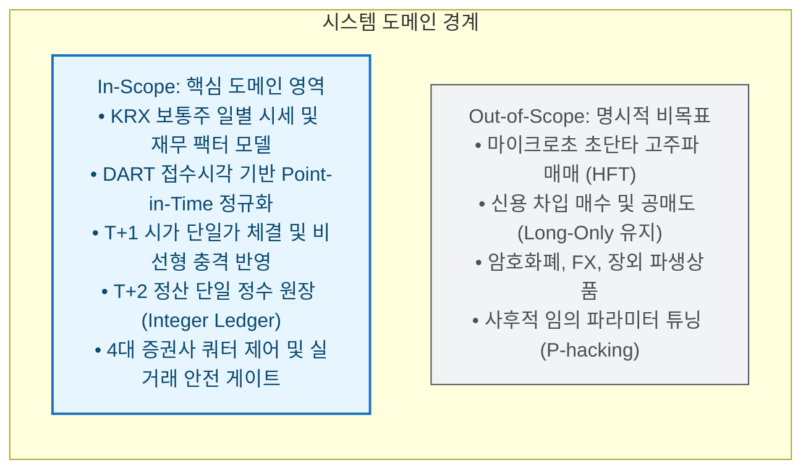
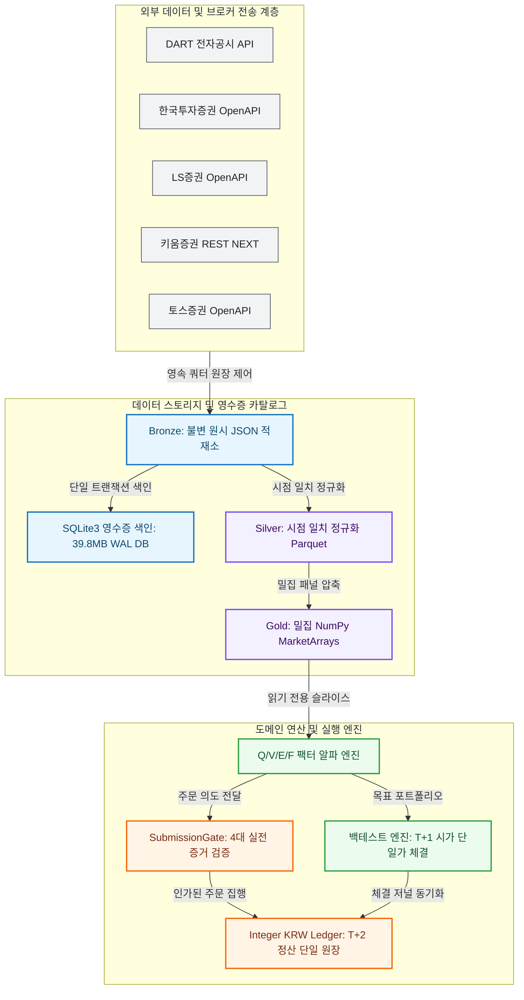
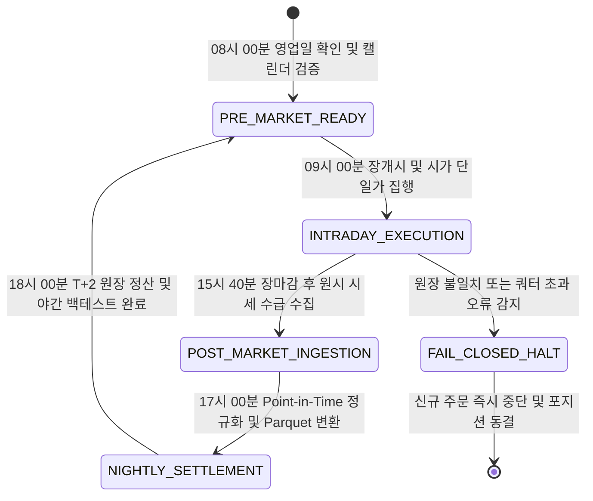
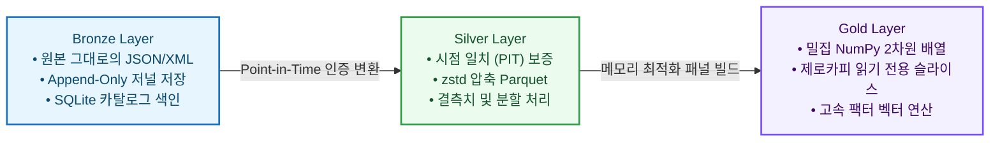
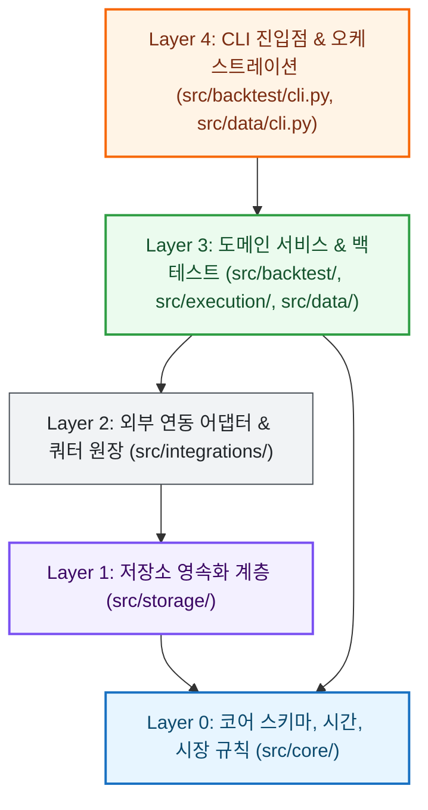

# System Design Specification

> **한국 주식 시장(KRX) 퀀트 트레이딩을 위한 도메인 아키텍처, 24/7 라이프사이클 및 금융 무결성 설계 명세**

---

## 1. System Objectives & Scope Boundaries

K-Stock Engine은 기하 복리 수익률 극대화와 무결점 실전 집행을 목표로 설계된 헥사고날(Hexagonal) 아키텍처 기반 퀀트 트레이딩 엔진입니다.



### 1.1 In-Scope (핵심 도메인 범위)
* **KRX 보통주 대상 기하 복리 투자**: KOSPI 및 KOSDAQ 상장 보통주를 대상으로 하며, 우선주·스팩·관리종목은 유니버스 단계에서 자동 배제.
* **Point-in-Time(시점 일치) 재무 데이터**: DART 전자공시의 실제 접수 시각(availability boundary)을 기준으로 데이터 접근 가능 시점을 엄격히 격리.
* **비선형 시장 충격 모델링**: 거래대금 대비 참여율(최대 1.0%)과 60일 변동성을 반영한 $k\sigma_{60}\sqrt{\frac{\text{Notional}}{\text{ADTV}_{20}}}$ 슬리피지 산출.
* **무결점 원 단위 정수 원장**: 부동소수점 오차를 배제한 `Integer KRW Ledger`로 체결, 수수료, 거래세, 배당금을 관리하며 T+2 결제 주기를 모델링.

### 1.2 Out-of-Scope (명시적 비목표)
* **고주파 매매(HFT) 및 틱 스캘핑**: 밀리초 이하 초단타 주문 집행이나 마켓메이킹은 범위에서 배제하며, 일별 세션 단위의 신호 및 체결에 집중.
* **신용 융자 및 공매도(Short Selling)**: 무한대 청산 리스크를 방지하기 위해 100% 롱온리(Long-Only) 현금 계좌 불변식을 유지.
* **장외 파생상품 및 가상자산**: 거래 구조와 정산 주기가 상이한 이종 자산군은 코어 엔진에서 분리 격리.

---

## 2. Component Topology & Multi-Broker Interfaces

엔진은 의존성 역전 원칙(DIP)에 따라 내부 비즈니스 로직이 외부 인터페이스의 변화에 영향받지 않도록 헥사고날 구조로 완벽히 분리됩니다.



### 2.1 외부 연동 브로커 및 공급자 규격
* **DART 전자공시**: HTTPS REST 기반. 일 16,000건 안전 예산, 5 req/s 스로틀링(최소 간격 0.2s)으로 공인 IP 차단을 원천 방어.
* **한국투자증권(KIS)**: 전역 18.0 req/s 공유 리미터, 24시간 유효 디스크 토큰(0600 권한 격리 및 원자적 갱신).
* **LS증권**: 1.05초 단위 상호 배제 락(Lock)을 적용하여 동시성 1 및 ~0.95 req/s의 엄격한 순차 호출 강제.
* **키움증권 (REST NEXT)**: TR당 5.0 req/s 동적 토큰 버킷, 64-bit Linux 네이티브 HTTPS 통신.
* **토스증권**: 그룹별 독립 토큰 버킷 운용 (시세 15/s, 차트 20/s, 실주문 10/s, 순위 5/s).

---

## 3. 24/7 State Machine & Orchestration Lifecycle

엔진은 24시간 무인 가동을 전제로 상태 전이를 수행하며, 이상 징후 발생 시 Fail-Closed 원칙에 따라 신규 주문을 차단합니다.



### 3.1 4단계 라이프사이클 상세 규약
1. **08:00 ~ 08:50 [PRE_MARKET_READY]**: KRX 영업일 확인, 관리종목/환기종목/우선주를 유니버스에서 배제하고 전일 18:00 기준 확정된 팩터 데이터를 동결.
2. **09:00 ~ 09:30 [INTRADAY_EXECUTION]**: 전일 종가 기반으로 산출된 목표 포트폴리오를 T+1 시가 단일가(Open-Auction)로 집행. 매도 주문을 매수 주문보다 항상 먼저 체결하여 예수금 초과를 차단.
3. **15:40 ~ 17:00 [POST_MARKET_INGESTION]**: 당일 확정 종가, 거래대금, 투자자별(외인/기관/개인) 순매수 수급 데이터를 수신하여 불변 원시 저널(Bronze)에 적재.
4. **17:00 ~ 21:00 [NIGHTLY_SETTLEMENT]**: DART 공시 시각을 반영한 Silver 레이어 재구성, T+2 결제 대금 정산, 밀집 Gold 패널 생성 및 전략 백테스트 성과 측정.

---

## 4. Data Models & Domain Financial Integrity Barriers



### 4.1 3대 금융 무결성 강제 장치
* **SQLite 영수증 카탈로그 (`ReceiptCatalog`)**:
  - 기존 114,833건 전체 JSON 재작성(23GB) 방식에서 WAL 모드 SQLite3 DB로 전면 전환.
  - 디스크 공간을 **39.8MB(99.8% 절감)**로 축소하고 단일 트랜잭션 원자적 커밋으로 프로세스 간 동시성 경합을 원천 차단.
* **전 계좌 정수 원장 (`Integer KRW Ledger`)**:
  - 부동소수점(`float`) 누적 오차를 방지하기 위해 모든 현금 흐름, 거래세, 수수료, 주식 수량을 순수 정수(`int`)로 관리.
  - 한국 실무에 따라 원 미만 금액은 원 단위 절사(`ROUND_FLOOR`)를 적용하며, 잔고 음수화 방지 불변식을 강제.
* **시점 일치 뷰어 (`PITView`)**:
  - 의사결정 시점(18:00 KST) 이전에 가용한 데이터만을 `bisect_right` 이진 탐색으로 분할 제공.
  - 마켓 시세 배열은 `writeable = False` 속성을 강제하여 전략 계층에서의 임의 수정을 구조적으로 방지.

---

## 5. Strict Architecture Layering & Invariant Enforcement

엔진은 5개 계층으로 엄격히 구조화되어 있으며, 상위 계층으로의 역참조는 일절 허용되지 않습니다.



### 5.1 계층 위계 및 허용 의존성
* `src/core`: 순수 도메인 모델, 시간 계약(`KRX_TZ`), KRX 캘린더, 호가 단위 및 거래세 규칙. 어떤 외부 모듈도 참조하지 않음.
* `src/storage`: Parquet I/O 및 데이터셋 매니페스트 관리. `core`에만 의존.
* `src/integrations`: 외부 API 전송 어댑터 및 `ProviderQuotaStateStore`. `core`와 `storage`에만 의존.
* `src/data`: 수집, 영수증 카탈로그, 정규화, 패널 빌더. `core`, `storage`, `integrations`에 의존.
* `src/execution` & `src/backtest`: 주문 검증, T+1 시가 체결, 정수 원장. `core`, `storage`, `data`에 의존.

### 5.2 Python AST 기반 기계적 불변식 강제
코드베이스의 모든 `import` 구문은 정적 AST 파서에 의해 전수 검사되며, 허용되지 않은 참조나 `legacy/` 패키지 침범 시 테스트가 즉시 실패합니다:
```bash
# 계층 경계 위반 0건 강제 및 래칫 축소 검증
uv run pytest tests/unit/core/test_package_dependency_boundaries.py
```
* **래칫(Ratchet) 메커니즘**: 기존의 알려진 위반 사항(`KNOWN_VIOLATIONS`)은 신규 추가가 엄격히 차단되며, 해결된 항목은 즉시 목록에서 제거되어 오직 단조 감소(Monotonic Shrinking)만 허용됩니다.
