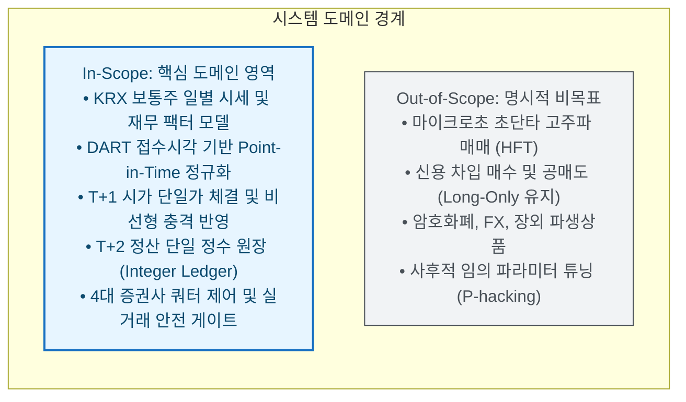
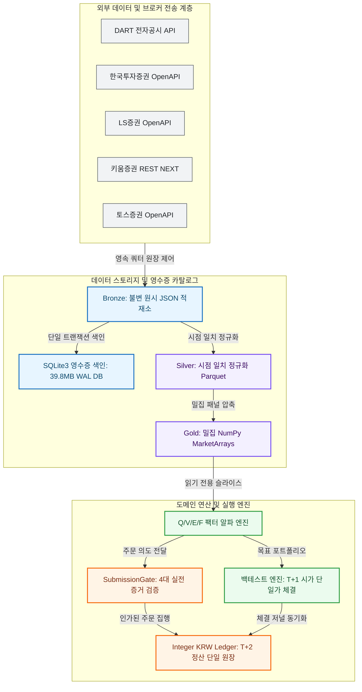
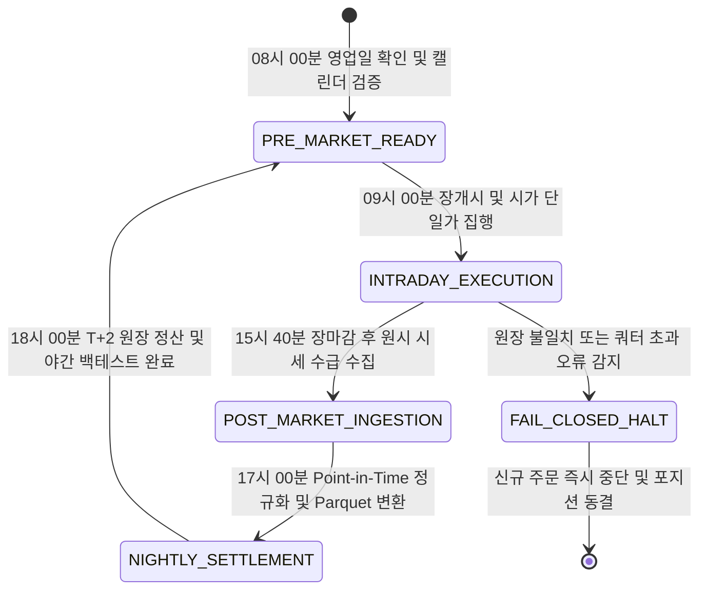
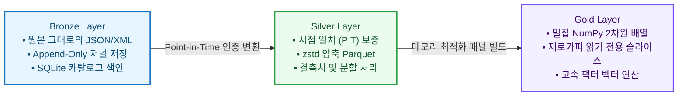
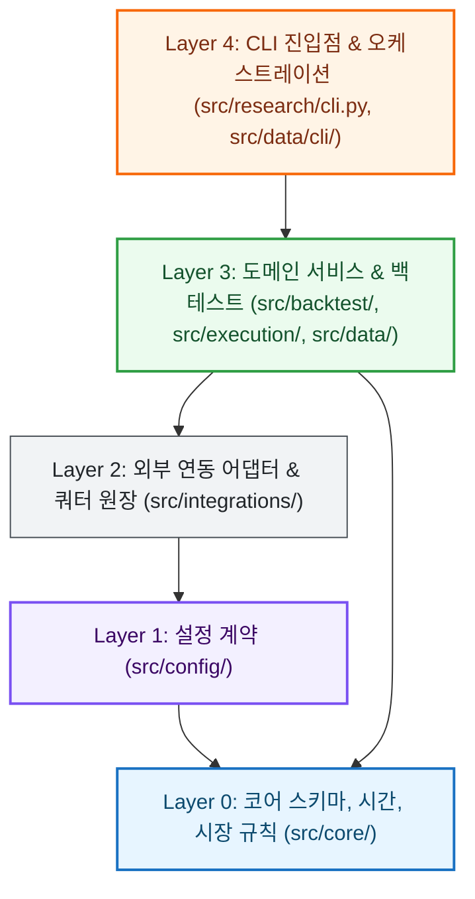

# System Design Specification

> **한국 주식 시장(KRX) 퀀트 트레이딩을 위한 도메인 아키텍처, 24/7 라이프사이클 및 금융 무결성 설계 명세**

---

## 1. System Objectives & Scope Boundaries

K-Stock Engine은 기하 복리 수익률 극대화와 무결점 실전 집행을 목표로 설계된 헥사고날(Hexagonal) 아키텍처 기반 퀀트 트레이딩 엔진입니다.


```mermaid
flowchart LR
    classDef inScope fill:#e7f5ff,stroke:#1971c2,stroke-width:2px,color:#0c4a6e;
    classDef outScope fill:#f1f3f5,stroke:#495057,stroke-width:1px,color:#495057;

    subgraph ScopeBoundary["시스템 도메인 경계"]
        In["In-Scope: 핵심 도메인 영역<br>• KRX 보통주 일별 시세 및 재무 팩터 모델<br>• DART 접수시각 기반 Point-in-Time 정규화<br>• T+1 시가 단일가 체결 및 비선형 충격 반영<br>• T+2 정산 단일 정수 원장 (Integer Ledger)<br>• 4대 증권사 쿼터 제어 및 실거래 안전 게이트"]:::inScope
        Out["Out-of-Scope: 명시적 비목표<br>• 마이크로초 초단타 고주파 매매 (HFT)<br>• 신용 차입 매수 및 공매도 (Long-Only 유지)<br>• 암호화폐, FX, 장외 파생상품<br>• 사후적 임의 파라미터 튜닝 (P-hacking)"]:::outScope
    end
```

### 1.1 In-Scope (핵심 도메인 범위)
* **KRX 보통주 대상 기하 복리 투자**: KOSPI 및 KOSDAQ 상장 보통주를 대상으로 하며, 우선주·스팩·관리종목은 유니버스 단계에서 자동 배제.
* **Point-in-Time(시점 일치) 재무 데이터**: DART 전자공시의 실제 접수 시각(availability boundary)을 기준으로 데이터 접근 가능 시점을 엄격히 격리.
* **비선형 시장 충격 모델링**: 거래대금 대비 참여율(최대 1.0%)과 60일 변동성을 반영한 $k\sigma_{60}\sqrt{\frac{\text{Notional}}{\text{ADTV}_{20}}}$ 슬리피지 산출.
* **무결점 원 단위 정수 원장**: 부동소수점 오차를 배제한 `Integer KRW Ledger`로 체결, 수수료, 거래세, 배당금을 관리하며 T+2 결제 주기를 모델링.

### 1.2 Out-of-Scope (명시적 비목표)
* **고주파 매매(HFT) 및 틱 스캘핑**: 밀리초 이하 초단타 주문 집행이나 마켓메이킹은 범위에서 배제하며, 일별 세션 단위의 신호 및 체결에 집중.
* **신용 융자 및 공매도(Short Selling)**: 무한대 청산 리스크를 방지하기 위해 100% 롱온리(Long-Only) 현금 계좌 불변식을 유지.
* **장외 파생상품 및 가상자산**: 거래 구조와 정산 주기가 상이한 이종 자산군은 코어 엔진에서 분리 격리.

---

## 2. Component Topology & Multi-Broker Interfaces

엔진은 의존성 역전 원칙(DIP)에 따라 내부 비즈니스 로직이 외부 인터페이스의 변화에 영향받지 않도록 헥사고날 구조로 완벽히 분리됩니다.


```mermaid
flowchart TD
    classDef vendor fill:#f1f3f5,stroke:#495057,stroke-width:1px,color:#212529;
    classDef premarket fill:#e7f5ff,stroke:#1971c2,stroke-width:2px,color:#0c4a6e;
    classDef intraday fill:#ebfbee,stroke:#2f9e44,stroke-width:2px,color:#14532d;
    classDef eod fill:#f3f0ff,stroke:#7950f2,stroke-width:2px,color:#3b0764;
    classDef exec fill:#fff4e6,stroke:#f76707,stroke-width:2px,color:#7c2d12;

    subgraph External["외부 데이터 및 브로커 전송 계층"]
        DART["DART 전자공시 API"]:::vendor
        KIS["한국투자증권 OpenAPI"]:::vendor
        LS["LS증권 OpenAPI"]:::vendor
        KW["키움증권 REST NEXT"]:::vendor
        TS["토스증권 OpenAPI"]:::vendor
    end

    subgraph StorageLayer["데이터 스토리지 및 영수증 카탈로그"]
        Cat["SQLite3 영수증 색인: 39.8MB WAL DB"]:::premarket
        BronzeStore["Bronze: 불변 원시 JSON 적재소"]:::premarket
        SilverStore["Silver: 시점 일치 정규화 Parquet"]:::eod
        GoldStore["Gold: 밀집 NumPy MarketArrays"]:::eod
    end

    subgraph EngineCore["도메인 연산 및 실행 엔진"]
        QVEF["Q/V/E/F 팩터 알파 엔진"]:::intraday
        BT["백테스트 엔진: T+1 시가 단일가 체결"]:::intraday
        Gate["SubmissionGate: 4대 실전 증거 검증"]:::exec
        Ledger["Integer KRW Ledger: T+2 정산 단일 원장"]:::exec
    end

    External -->|영속 쿼터 원장 제어| BronzeStore
    BronzeStore -->|단일 트랜잭션 색인| Cat
    BronzeStore -->|시점 일치 정규화| SilverStore
    SilverStore -->|밀집 패널 압축| GoldStore
    GoldStore -->|읽기 전용 슬라이스| QVEF
    QVEF -->|목표 포트폴리오| BT
    QVEF -->|주문 의도 전달| Gate
    Gate -->|인가된 주문 집행| Ledger
    BT -->|체결 저널 동기화| Ledger
```

### 2.1 외부 연동 브로커 및 공급자 규격
* **DART 전자공시**: HTTPS REST 기반. 일 16,000건 안전 예산, 5 req/s 스로틀링(최소 간격 0.2s)으로 공인 IP 차단을 원천 방어.
* **한국투자증권(KIS)**: 전역 18.0 req/s 공유 리미터, 24시간 유효 디스크 토큰(0600 권한 격리 및 원자적 갱신).
* **LS증권**: 1.05초 단위 상호 배제 락(Lock)을 적용하여 동시성 1 및 ~0.95 req/s의 엄격한 순차 호출 강제.
* **키움증권 (REST NEXT)**: TR당 5.0 req/s 동적 토큰 버킷, 64-bit Linux 네이티브 HTTPS 통신.
* **토스증권**: 그룹별 독립 토큰 버킷 운용 (시세 15/s, 차트 20/s, 실주문 10/s, 순위 5/s).

---

## 3. 24/7 State Machine & Orchestration Lifecycle

엔진은 24시간 무인 가동을 전제로 상태 전이를 수행하며, 이상 징후 발생 시 Fail-Closed 원칙에 따라 신규 주문을 차단합니다.


```mermaid
stateDiagram-v2
    [*] --> PRE_MARKET_READY: 08시 00분 영업일 확인 및 캘린더 검증
    PRE_MARKET_READY --> INTRADAY_EXECUTION: 09시 00분 장개시 및 시가 단일가 집행
    INTRADAY_EXECUTION --> POST_MARKET_INGESTION: 15시 40분 장마감 후 원시 시세 수급 수집
    POST_MARKET_INGESTION --> NIGHTLY_SETTLEMENT: 17시 00분 Point-in-Time 정규화 및 Parquet 변환
    NIGHTLY_SETTLEMENT --> PRE_MARKET_READY: 18시 00분 T+2 원장 정산 및 야간 백테스트 완료

    INTRADAY_EXECUTION --> FAIL_CLOSED_HALT: 원장 불일치 또는 쿼터 초과 오류 감지
    FAIL_CLOSED_HALT --> [*]: 신규 주문 즉시 중단 및 포지션 동결
```

### 3.1 4단계 라이프사이클 상세 규약
1. **08:00 ~ 08:50 [PRE_MARKET_READY]**: KRX 영업일 확인, 관리종목/환기종목/우선주를 유니버스에서 배제하고 전일 18:00 기준 확정된 팩터 데이터를 동결.
2. **09:00 ~ 09:30 [INTRADAY_EXECUTION]**: 전일 종가 기반으로 산출된 목표 포트폴리오를 T+1 시가 단일가(Open-Auction)로 집행. 매도 주문을 매수 주문보다 항상 먼저 체결하여 예수금 초과를 차단.
3. **15:40 ~ 17:00 [POST_MARKET_INGESTION]**: 당일 확정 종가, 거래대금, 투자자별(외인/기관/개인) 순매수 수급 데이터를 수신하여 불변 원시 저널(Bronze)에 적재.
4. **17:00 ~ 21:00 [NIGHTLY_SETTLEMENT]**: DART 공시 시각을 반영한 Silver 레이어 재구성, T+2 결제 대금 정산, 밀집 Gold 패널 생성 및 전략 백테스트 성과 측정.

---

## 4. Data Models & Domain Financial Integrity Barriers


```mermaid
flowchart LR
    classDef stage1 fill:#e7f5ff,stroke:#1971c2,stroke-width:2px,color:#0c4a6e;
    classDef stage2 fill:#ebfbee,stroke:#2f9e44,stroke-width:2px,color:#14532d;
    classDef stage3 fill:#f3f0ff,stroke:#7950f2,stroke-width:2px,color:#3b0764;

    B["Bronze Layer<br>• 원본 그대로의 JSON/XML<br>• Append-Only 저널 저장<br>• SQLite 카탈로그 색인"]:::stage1
    S["Silver Layer<br>• 시점 일치 (PIT) 보증<br>• zstd 압축 Parquet<br>• 결측치 및 분할 처리"]:::stage2
    G["Gold Layer<br>• 밀집 NumPy 2차원 배열<br>• 제로카피 읽기 전용 슬라이스<br>• 고속 팩터 벡터 연산"]:::stage3

    B -->|Point-in-Time 인증 변환| S
    S -->|메모리 최적화 패널 빌드| G
```

### 4.1 3대 금융 무결성 강제 장치
* **SQLite 영수증 카탈로그 (`ReceiptCatalog`)**:
  - 기존 114,833건 전체 JSON 재작성(23GB) 방식에서 WAL 모드 SQLite3 DB로 전면 전환.
  - 디스크 공간을 **39.8MB(99.8% 절감)**로 축소하고 단일 트랜잭션 원자적 커밋으로 프로세스 간 동시성 경합을 원천 차단.
* **전 계좌 정수 원장 (`Integer KRW Ledger`)**:
  - 부동소수점(`float`) 누적 오차를 방지하기 위해 모든 현금 흐름, 거래세, 수수료, 주식 수량을 순수 정수(`int`)로 관리.
  - 한국 실무에 따라 원 미만 금액은 원 단위 절사(`ROUND_FLOOR`)를 적용하며, 잔고 음수화 방지 불변식을 강제.
* **시점 일치 뷰어 (`PITView`)**:
  - 의사결정 시점(18:00 KST) 이전에 가용한 데이터만을 `bisect_right` 이진 탐색으로 분할 제공.
  - 마켓 시세 배열은 `writeable = False` 속성을 강제하여 전략 계층에서의 임의 수정을 구조적으로 방지.

---

## 5. Strict Architecture Layering & Invariant Enforcement

엔진은 5개 계층으로 엄격히 구조화되어 있으며, 상위 계층으로의 역참조는 일절 허용되지 않습니다.


```mermaid
flowchart TD
    classDef l4 fill:#fff4e6,stroke:#f76707,stroke-width:2px,color:#7c2d12;
    classDef l3 fill:#ebfbee,stroke:#2f9e44,stroke-width:2px,color:#14532d;
    classDef l2 fill:#f1f3f5,stroke:#495057,stroke-width:1px,color:#212529;
    classDef l1 fill:#f3f0ff,stroke:#7950f2,stroke-width:2px,color:#3b0764;
    classDef l0 fill:#e7f5ff,stroke:#1971c2,stroke-width:2px,color:#0c4a6e;

    L4["Layer 4: CLI 진입점 & 오케스트레이션 (src/research/cli.py, src/data/cli/)"]:::l4
    L3["Layer 3: 도메인 서비스 & 백테스트 (src/backtest/, src/execution/, src/data/)"]:::l3
    L2["Layer 2: 외부 연동 어댑터 & 쿼터 원장 (src/integrations/)"]:::l2
    L1["Layer 1: 설정 계약 (src/config/)"]:::l1
    L0["Layer 0: 코어 스키마, 시간, 시장 규칙 (src/core/)"]:::l0

    L4 --> L3
    L3 --> L2
    L2 --> L1
    L1 --> L0
    L3 --> L0
```

### 5.1 계층 위계 및 허용 의존성
* `src/core`: 순수 도메인 모델, 시간 계약(`KRX_TZ`), KRX 캘린더, 호가 단위 및 거래세 규칙. 어떤 외부 모듈도 참조하지 않음.
* `src/config`: 프로바이더 정책, 스코프 TOML. `core`에만 의존.
* `src/integrations`: 외부 API 전송 어댑터 및 `ProviderQuotaStateStore`. `core`와 `config`에만 의존.
* `src/data`: 수집, 영수증 카탈로그, 정규화, 패널 빌더. `core`, `config`, `integrations`에 의존.
* `src/execution`: 주문 검증, T+1 시가 체결, 정수 원장. `core`에만 의존.
* `src/backtest`: 전략과 백테스트 엔진. `core`, `config`, `data`에 의존.

### 5.2 Python AST 기반 기계적 불변식 강제
코드베이스의 모든 `import` 구문은 정적 AST 파서에 의해 전수 검사되며, 허용되지 않은 참조나 `legacy/` 패키지 침범 시 테스트가 즉시 실패합니다:
```bash
# 계층 경계 위반 0건 강제 및 래칫 축소 검증
uv run pytest tests/unit/core/test_package_dependency_boundaries.py
```
* **래칫(Ratchet) 메커니즘**: 기존의 알려진 위반 사항(`KNOWN_VIOLATIONS`)은 신규 추가가 엄격히 차단되며, 해결된 항목은 즉시 목록에서 제거되어 오직 단조 감소(Monotonic Shrinking)만 허용됩니다.

---

## 6. Single Strategy Path (단일 전략 경로)

리서치부터 원장 검증까지 정확히 하나의 전략 경로만 존재한다: `panel → scorer → policy → sleeves/book → account engine (ledger) → report card`.

* **Panel (`src/research/panel.py`)**: 인과적 피처 패널. 결정 세션 `T`의 모든 피처·라벨은 `T` 이전에 관측 가능한 데이터로만 구성되며, 전월(全月) 재무·수급 사실을 사용한다.
* **Scorer (`src/research/model.py`)**: 워크포워드 LightGBM 호라이즌 앙상블. 연도별 폴드는 테스트 연도 이전 데이터로만 학습하고, purge 구간으로 라벨 중첩을 제거한다.
* **Policy (`src/research/policy.py`)**: ML 상위 20선(`n=20`) + `ret21 > 0` 단일 추세 현금 규칙(`dev_ma20` 구간은 비활성화). 규칙을 통과한 선택 종목만 편입하고 나머지는 현금으로 보유한다.
* **Sleeves/Book (`src/research/book.py`)**: 리밸런스 위상별 5개 슬리브(각자 주식 자본의 1/5로 목표 산출·시뮬레이션)와 전진충전 평균 결합북. 위상 운(phase luck)을 구조적으로 제거한다.
* **Hedge overlay (`src/research/hedge.py`, Silver `hedge_series`)**: KOSDAQ 150 롤링 베타에 대한 베타중립 숏 헤지. 지수선물 정수 계약을 핵심으로, 계약 미만 잔여는 실물 인버스 ETF로 충당한다. 증거금·위탁 비용과 세율(지수선물 이익 11%, 연 250만원 공제, 손실 이월 없음; 인버스 ETF 이익 15.4%, 손실 상계 없음)을 NAV 시뮬레이션에 반영한다.
* **Account engine (`src/backtest/engine.py`, `src/research/ledger_bridge.py`)**: 평가 대상은 정수 원장 하나뿐이다. 결합 5-슬리브 주식 목표를 다음 세션 시가에 매도 우선·정수주·음수 현금 금지로 집행하며, 지수선물(주 레그: 베타 헤지 또는 K200 추세 오버레이, 보조 레그: KQ150 레짐 헤지)·인버스 ETF·현금 수익까지 한 계좌에서 정산한다. 선물 레그는 증거금을 통합하고(주 레그 우선 자금 배정) 파생 양도세는 전 레그 연간 순손익 합산으로 과세한다. 네 시나리오(base·stress_slippage·stress_delay·cost grid)와 unhedged·placebo가 모두 이 엔진에서 나온다.
* **Weight simulator (`src/research/simulator.py`)**: 가중치 공간 스크리칭·인과적 섭동 검사용 근사. 평가는 하지 않으며 계정 엔진과의 성장률 차이(`fast_sim_gap`)는 보고 항목으로만 남는다.
* **Report card (`src/research/evaluation.py`, `src/research/stats.py`)**: 단일 목적함수 J(5년 블록 부트스트랩 성장률의 하위 10% 분위수)를 더 나쁜 스트레스 스트림에서 계산하고, 파산 가드는 P(5y g ≤ 0) ≤ 5%만 승격을 막는다(P(5y MDD ≤ −50%)는 보고만 하며 `max_p_ruin = 1.0`으로 비차단). 무결성(섭동 불일치 0, 스트림 정렬·유한성)은 그대로 차단한다. 나머지 수치(연율, 변동성, MDD, calmar, 연도·레짐별 성장, 비용 그리드, 손익분기 틱, placebo·EW 벤치마크, 최근 252세션)는 진단 보고용이며 판정에 영향을 주지 않는다.
* **Window guard (`src/data/research_protocol.py`)**: 프로토콜 v6는 `[evaluation_start, 마지막 인증 세션]` 밖의 구간 실행만 금지한다. 밀봉 홀드아웃·최종 후보·시행 회수 벌점은 없다 — 선택 편향은 챔피언/챌린저 페어드 비교·이웃 평탄부·비용 그리드로 통제한다.
* **Champion store (`src/research/champion.py`)**: 챌린저와 현 챔피언을 **같은 세션·같은 스트레스 스트림**에서 페어드 블록 부트스트랩으로 비교한다(공통 시장 노이즈가 상쇄). 승격은 다음 두 경로 중 하나를 충족해야 한다:
  1. **우월성 경로 (Superiority)**: ① 챌린저 보고 카드 통과 ② 페어드 Δg 하한(α_eff, 한쪽) > 0 ③ 챌린저 J ≥ 챔피언 J ④ 숫자 노브 변경 시 노브별 이웃 변형의 평균 Δg > 0.
  2. **비열등성 경로 (Non-inferiority, δ 허용오차)**: 동일한 보고 카드 통과, J 비교, 이웃 조건 하에서, 페어드 Δg 하한 > -δ이면서 페어드 CVaR 차이 하한 > 0이면 승격한다. δ(`noninferiority_margin`)는 꼬리 위험 축소의 대가로 허용하는 연간 로그 성장률 손실로, v6은 3%p를 사전 선언하며 결과를 본 뒤 재조정하지 않는다(미설정 시 경로 비활성). CVaR은 경로를 겹치지 않는 `tail_block_sessions`(21) 세션 블록으로 나눈 로그수익 합 중 하위 `tail_quantile`(5%) 평균이다 — MDD는 1~2개 에피소드로 정해져 페어드 검정력이 없기 때문이다. 같은 α_eff·페어드 지평을 쓰므로 더 싼 두 번째 검정이 아니며, 둘 다 만족하면 우월성이 우선한다(판정 사유는 `superiority:`/`noninferiority:` 접두사로 기록).
  `multiplicity="bonferroni_decisions"`에서는 α_eff = α/(1+m) (m은 현 챔피언을 지명한 저장 판정 수), `paired_horizon="full"`에서는 전체 공유 표본 길이로 부트스트랩한다. `<state>/research/champion/`에 `current.json`(원자 교체)·`history.jsonl`·`decisions/<digest>.json`(추가 전용)으로 남기며, 판정 JSON은 `alpha_effective`·`paired_horizon_sessions`·`path`를 기록한다. 승격 기록의 신원은 TOML 경로가 아니라 저장된 `spec_json`이다. 챔피언 파일은 저장된 spec_json에서 생성되는 뷰이며 해시가 어긋나면 challenge/promote가 중단된다.

이웃 검증은 전략 선택에 적용한다. 추세 오버레이 및 레짐 헷지의 계약승수·증거금/버퍼·추가증거금 트리거·비용·세율·연간 공제는 계약 조건으로 면제하되 `knob_changes`에 기록한다. 오버레이 도입/제거 시 `hedge.hedge_ratio`와 새 오버레이의 리밸런싱 주기는 구조 전환으로 면제한다(활성 추세 오버레이에 헤지 비율을 더하는 이웃은 단일 오버레이 불변식을 위반). 도입 시에도 MA/신호·롱/숏 비중, 주식 정책과 북의 밴드는 이웃 검증을 요구한다. 오버레이 제거 시 제거된 노브는 면제하며, 양쪽에 오버레이가 있는 경우 리밸런싱 주기 변경은 이웃 검증을 요구한다. 제공한 모든 이웃의 평균 Δg > 0 (또는 비열등성 경로 시 평균 Δg > -δ 및 평균 tail Δ > 0), 보고 카드 통과, 페어드 하한과 J 조건은 그대로 적용한다.

```bash
# 헤지 시계열 수집·정제 (Part 1)
uv run python -m src.data.cli collect-krx-hedge-series
uv run python -m src.data.cli build-hedge-series-silver
# 평가 실행 (단일 사전 등록 스펙) → 리포트 카드 JSON
uv run python -m src.research evaluate --spec config/research/challenge/<name>.toml
# 챔피언 최초 등록 / 대결 판정(상태 불변) / 승격 / 현재 상태
uv run python -m src.research promote --spec config/research/challenge/<name>.toml --bootstrap
uv run python -m src.research challenge --spec <challenger.toml> --neighbors <neighbor.toml ...>
uv run python -m src.research promote --spec <challenger.toml>
uv run python -m src.research champion
uv run python -m src.research champion --sync-file  # 저장된 spec_json을 config/research/champion.toml에 동기화
```

### 6.1 Champion Status (챔피언 상태)

| 항목 | 상태 | 비고 |
| :--- | :---: | :--- |
| Champion | `none` | `promote --spec <PATH> --bootstrap`으로 최초 등록, 이후 승격은 저장된 판정(`challenge`)이 있을 때만 |
| Challenger | `unevaluated` | 같은 세션에서 페어드 블록 부트스트랩 Δg와 이웃 평탄부로 판정 |
| Forward evidence | `out of scope` | 라이브 매매 시작 시 스펙 01과 함께 재개 |
